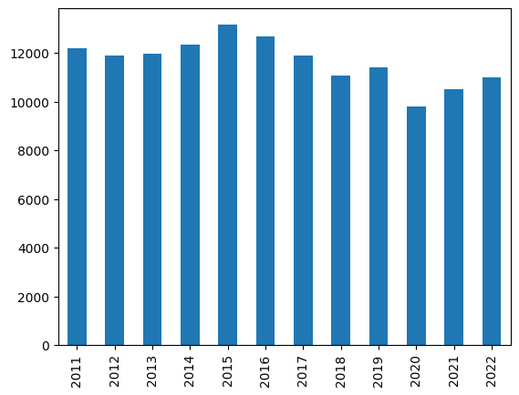
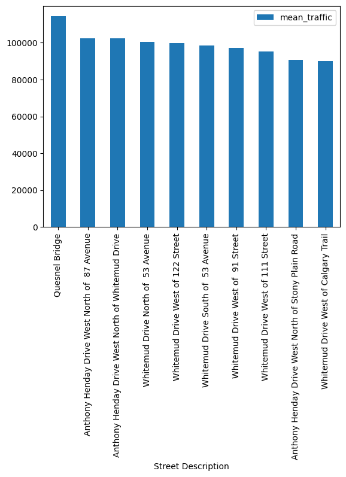
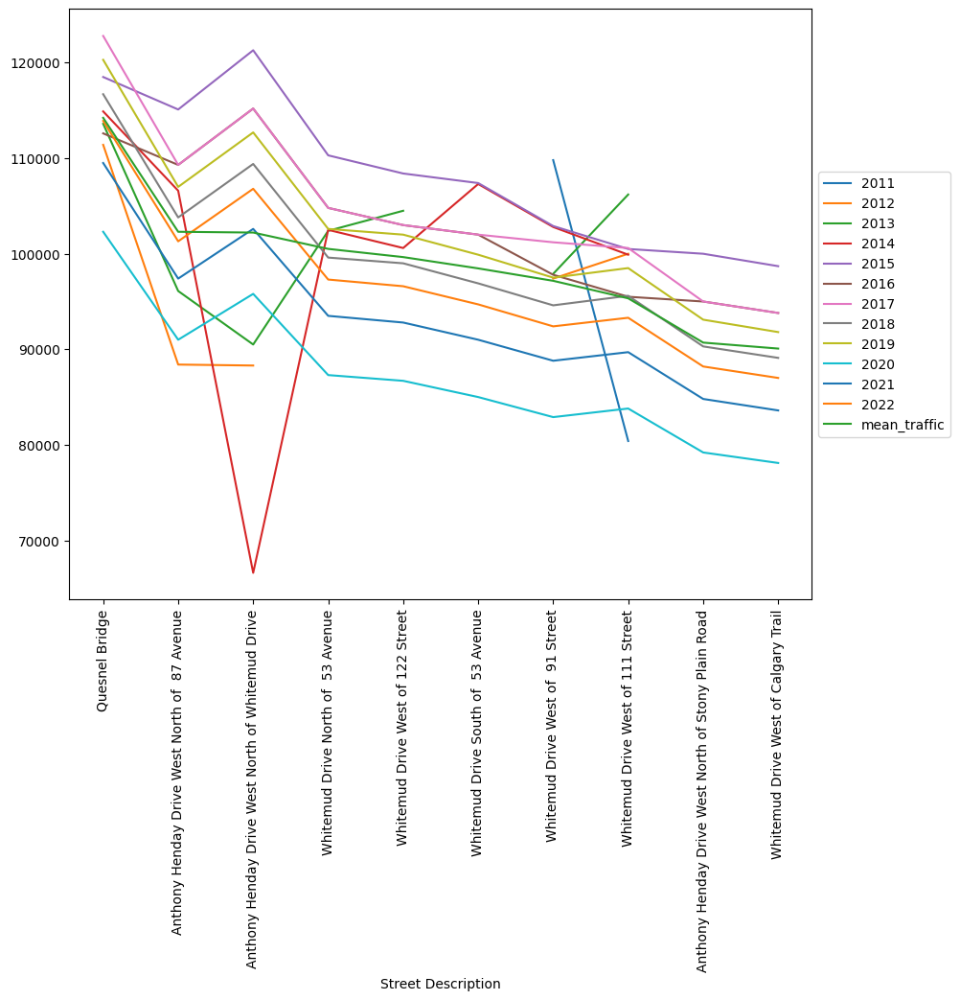
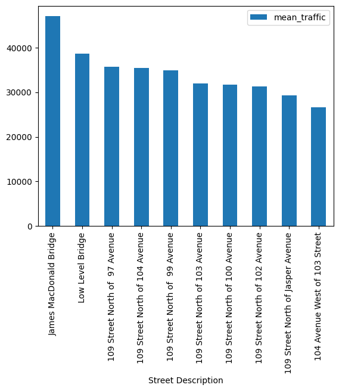
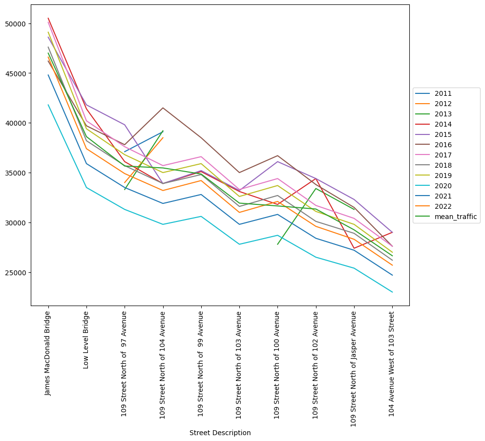
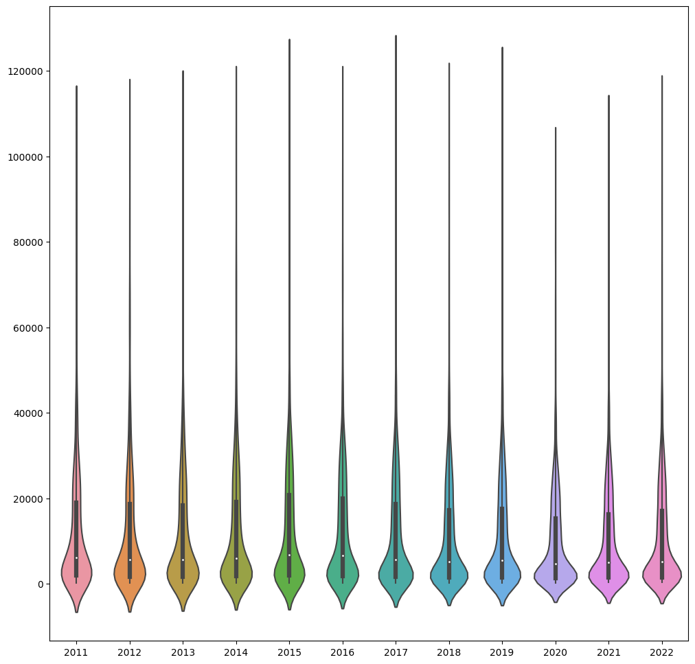

# Edmonton Traffic and Congestion Analysis
Let's analyize traffic data from the City of Edmonton using the Average Annual Weekday Traffic Data Set provided by the City of Edmonton.
Some preliminary questions:
- How has the traffic density changed over the years since data has been collected?
- Which avenues and streets are subjected to denser traffic throughout the week?
- Evolution of traffic for the areas with denser traffic count.


```python
import pandas as pd
import calendar, datetime
import folium
import matplotlib.pyplot as plt
import seaborn as sns
```

## Loading Data


```python
data = pd.read_csv('./data-src/AAWDT.csv')
```

## Exploratory Analysis
- Understanding data types and shape of the dataframe


```python
data.head()
```


<div>
<style scoped>
    .dataframe tbody tr th:only-of-type {
        vertical-align: middle;
    }

    .dataframe tbody tr th {
        vertical-align: top;
    }

    .dataframe thead th {
        text-align: right;
    }
</style>
<table border="1" class="dataframe">
  <thead>
    <tr style="text-align: right;">
      <th></th>
      <th>Site Number</th>
      <th>Street Description</th>
      <th>Lat</th>
      <th>Long</th>
      <th>Lat Adjusted</th>
      <th>Long Adjusted</th>
      <th>2011</th>
      <th>2012</th>
      <th>2013</th>
      <th>2014</th>
      <th>2015</th>
      <th>2016</th>
      <th>2017</th>
      <th>2018</th>
      <th>2019</th>
      <th>2020</th>
      <th>2021</th>
      <th>2022</th>
    </tr>
  </thead>
  <tbody>
    <tr>
      <th>0</th>
      <td>505840</td>
      <td>2 Avenue SW West of  65 Street SW</td>
      <td>53.430849</td>
      <td>-113.441704</td>
      <td>53.430849</td>
      <td>-113.441704</td>
      <td>3000</td>
      <td>2900</td>
      <td>3000</td>
      <td>3100</td>
      <td>3100</td>
      <td>2900</td>
      <td>3400</td>
      <td>3200</td>
      <td>3300</td>
      <td>2900</td>
      <td>3200</td>
      <td>3400</td>
    </tr>
    <tr>
      <th>1</th>
      <td>505608</td>
      <td>3 Avenue SW West of  58 Street SW</td>
      <td>53.430372</td>
      <td>-113.431425</td>
      <td>53.430372</td>
      <td>-113.431425</td>
      <td>-</td>
      <td>1400</td>
      <td>1500</td>
      <td>1500</td>
      <td>1500</td>
      <td>1400</td>
      <td>1400</td>
      <td>2600</td>
      <td>2700</td>
      <td>2300</td>
      <td>2500</td>
      <td>2600</td>
    </tr>
    <tr>
      <th>2</th>
      <td>430645</td>
      <td>3 Street NE North of 161 Avenue NE</td>
      <td>53.624098</td>
      <td>-113.335494</td>
      <td>53.624098</td>
      <td>-113.335494</td>
      <td>-</td>
      <td>300</td>
      <td>400</td>
      <td>400</td>
      <td>400</td>
      <td>400</td>
      <td>600</td>
      <td>600</td>
      <td>700</td>
      <td>600</td>
      <td>700</td>
      <td>800</td>
    </tr>
    <tr>
      <th>3</th>
      <td>505464</td>
      <td>4 Avenue SW West of  50 Street SW</td>
      <td>53.428640</td>
      <td>-113.421120</td>
      <td>53.428640</td>
      <td>-113.421120</td>
      <td>-</td>
      <td>1200</td>
      <td>1200</td>
      <td>1200</td>
      <td>1200</td>
      <td>1100</td>
      <td>5600</td>
      <td>5200</td>
      <td>5400</td>
      <td>4600</td>
      <td>5000</td>
      <td>5200</td>
    </tr>
    <tr>
      <th>4</th>
      <td>204850</td>
      <td>9 Avenue SW West of 207 Street SW</td>
      <td>53.424944</td>
      <td>-113.683073</td>
      <td>53.424944</td>
      <td>-113.683073</td>
      <td>300</td>
      <td>300</td>
      <td>300</td>
      <td>300</td>
      <td>300</td>
      <td>400</td>
      <td>400</td>
      <td>400</td>
      <td>500</td>
      <td>500</td>
      <td>600</td>
      <td>700</td>
    </tr>
  </tbody>
</table>
</div>


```python
data.shape
```


    (4245, 18)


```python
data.dtypes
```


    Site Number             int64
    Street Description     object
    Lat                   float64
    Long                  float64
    Lat Adjusted          float64
    Long Adjusted         float64
    2011                   object
    2012                   object
    2013                   object
    2014                   object
    2015                   object
    2016                   object
    2017                   object
    2018                    int64
    2019                    int64
    2020                    int64
    2021                    int64
    2022                    int64
    dtype: object


## Data preprocessing
- Data stored in columns 2011 to 2017 are stored as strings


```python
str_col = ['2011','2012','2013','2014','2015','2016','2017']

for col in str_col:
    data[col] = pd.to_numeric(data[col],errors='coerce')

data.head()
```


<div>
<style scoped>
    .dataframe tbody tr th:only-of-type {
        vertical-align: middle;
    }

    .dataframe tbody tr th {
        vertical-align: top;
    }

    .dataframe thead th {
        text-align: right;
    }
</style>
<table border="1" class="dataframe">
  <thead>
    <tr style="text-align: right;">
      <th></th>
      <th>Site Number</th>
      <th>Street Description</th>
      <th>Lat</th>
      <th>Long</th>
      <th>Lat Adjusted</th>
      <th>Long Adjusted</th>
      <th>2011</th>
      <th>2012</th>
      <th>2013</th>
      <th>2014</th>
      <th>2015</th>
      <th>2016</th>
      <th>2017</th>
      <th>2018</th>
      <th>2019</th>
      <th>2020</th>
      <th>2021</th>
      <th>2022</th>
      <th>mean_traffic</th>
    </tr>
  </thead>
  <tbody>
    <tr>
      <th>0</th>
      <td>505840</td>
      <td>2 Avenue SW West of  65 Street SW</td>
      <td>53.430849</td>
      <td>-113.441704</td>
      <td>53.430849</td>
      <td>-113.441704</td>
      <td>3000.0</td>
      <td>2900.0</td>
      <td>3000.0</td>
      <td>3100.0</td>
      <td>3100.0</td>
      <td>2900.0</td>
      <td>3400.0</td>
      <td>3200</td>
      <td>3300</td>
      <td>2900</td>
      <td>3200</td>
      <td>3400</td>
      <td>3116.666667</td>
    </tr>
    <tr>
      <th>1</th>
      <td>505608</td>
      <td>3 Avenue SW West of  58 Street SW</td>
      <td>53.430372</td>
      <td>-113.431425</td>
      <td>53.430372</td>
      <td>-113.431425</td>
      <td>NaN</td>
      <td>1400.0</td>
      <td>1500.0</td>
      <td>1500.0</td>
      <td>1500.0</td>
      <td>1400.0</td>
      <td>1400.0</td>
      <td>2600</td>
      <td>2700</td>
      <td>2300</td>
      <td>2500</td>
      <td>2600</td>
      <td>1945.454545</td>
    </tr>
    <tr>
      <th>2</th>
      <td>430645</td>
      <td>3 Street NE North of 161 Avenue NE</td>
      <td>53.624098</td>
      <td>-113.335494</td>
      <td>53.624098</td>
      <td>-113.335494</td>
      <td>NaN</td>
      <td>300.0</td>
      <td>400.0</td>
      <td>400.0</td>
      <td>400.0</td>
      <td>400.0</td>
      <td>600.0</td>
      <td>600</td>
      <td>700</td>
      <td>600</td>
      <td>700</td>
      <td>800</td>
      <td>536.363636</td>
    </tr>
    <tr>
      <th>3</th>
      <td>505464</td>
      <td>4 Avenue SW West of  50 Street SW</td>
      <td>53.428640</td>
      <td>-113.421120</td>
      <td>53.428640</td>
      <td>-113.421120</td>
      <td>NaN</td>
      <td>1200.0</td>
      <td>1200.0</td>
      <td>1200.0</td>
      <td>1200.0</td>
      <td>1100.0</td>
      <td>5600.0</td>
      <td>5200</td>
      <td>5400</td>
      <td>4600</td>
      <td>5000</td>
      <td>5200</td>
      <td>3354.545455</td>
    </tr>
    <tr>
      <th>4</th>
      <td>204850</td>
      <td>9 Avenue SW West of 207 Street SW</td>
      <td>53.424944</td>
      <td>-113.683073</td>
      <td>53.424944</td>
      <td>-113.683073</td>
      <td>300.0</td>
      <td>300.0</td>
      <td>300.0</td>
      <td>300.0</td>
      <td>300.0</td>
      <td>400.0</td>
      <td>400.0</td>
      <td>400</td>
      <td>500</td>
      <td>500</td>
      <td>600</td>
      <td>700</td>
      <td>416.666667</td>
    </tr>
  </tbody>
</table>
</div>


### Exploratory Analysis
- General statistics


```python
data.describe()
```


<div>
<style scoped>
    .dataframe tbody tr th:only-of-type {
        vertical-align: middle;
    }

    .dataframe tbody tr th {
        vertical-align: top;
    }

    .dataframe thead th {
        text-align: right;
    }
</style>
<table border="1" class="dataframe">
  <thead>
    <tr style="text-align: right;">
      <th></th>
      <th>Site Number</th>
      <th>Lat</th>
      <th>Long</th>
      <th>Lat Adjusted</th>
      <th>Long Adjusted</th>
      <th>2011</th>
      <th>2012</th>
      <th>2013</th>
      <th>2014</th>
      <th>2015</th>
      <th>2016</th>
      <th>2017</th>
      <th>2018</th>
      <th>2019</th>
      <th>2020</th>
      <th>2021</th>
      <th>2022</th>
    </tr>
  </thead>
  <tbody>
    <tr>
      <th>count</th>
      <td>4245.000000</td>
      <td>4245.000000</td>
      <td>4245.000000</td>
      <td>4245.000000</td>
      <td>4.245000e+03</td>
      <td>1646.000000</td>
      <td>1881.000000</td>
      <td>2237.000000</td>
      <td>2730.000000</td>
      <td>3451.000000</td>
      <td>3451.000000</td>
      <td>4021.000000</td>
      <td>4245.000000</td>
      <td>4245.000000</td>
      <td>4245.000000</td>
      <td>4245.000000</td>
      <td>4245.000000</td>
    </tr>
    <tr>
      <th>mean</th>
      <td>328000.404711</td>
      <td>53.532465</td>
      <td>-113.503709</td>
      <td>53.532468</td>
      <td>-2.673187e+05</td>
      <td>12193.134872</td>
      <td>11896.012759</td>
      <td>11975.502906</td>
      <td>12330.219780</td>
      <td>13160.213272</td>
      <td>12688.032454</td>
      <td>11896.841582</td>
      <td>11064.122497</td>
      <td>11392.131920</td>
      <td>9784.876325</td>
      <td>10519.458186</td>
      <td>10990.600707</td>
    </tr>
    <tr>
      <th>std</th>
      <td>146733.642918</td>
      <td>0.055283</td>
      <td>0.074108</td>
      <td>0.055282</td>
      <td>1.740940e+07</td>
      <td>14760.365734</td>
      <td>14989.920729</td>
      <td>15055.046247</td>
      <td>15024.149814</td>
      <td>15601.325859</td>
      <td>14949.132646</td>
      <td>14487.985500</td>
      <td>13616.323694</td>
      <td>13975.869008</td>
      <td>11915.809055</td>
      <td>12749.045655</td>
      <td>13256.543695</td>
    </tr>
    <tr>
      <th>min</th>
      <td>100004.000000</td>
      <td>53.391487</td>
      <td>-113.718372</td>
      <td>53.391487</td>
      <td>-1.134286e+09</td>
      <td>100.000000</td>
      <td>100.000000</td>
      <td>100.000000</td>
      <td>100.000000</td>
      <td>100.000000</td>
      <td>100.000000</td>
      <td>100.000000</td>
      <td>100.000000</td>
      <td>200.000000</td>
      <td>200.000000</td>
      <td>300.000000</td>
      <td>400.000000</td>
    </tr>
    <tr>
      <th>25%</th>
      <td>229948.000000</td>
      <td>53.494151</td>
      <td>-113.543732</td>
      <td>53.494119</td>
      <td>-1.135439e+02</td>
      <td>1900.000000</td>
      <td>1700.000000</td>
      <td>1700.000000</td>
      <td>1800.000000</td>
      <td>1900.000000</td>
      <td>1800.000000</td>
      <td>1600.000000</td>
      <td>1400.000000</td>
      <td>1500.000000</td>
      <td>1300.000000</td>
      <td>1400.000000</td>
      <td>1500.000000</td>
    </tr>
    <tr>
      <th>50%</th>
      <td>316326.000000</td>
      <td>53.537539</td>
      <td>-113.501545</td>
      <td>53.537539</td>
      <td>-1.135016e+02</td>
      <td>6100.000000</td>
      <td>5600.000000</td>
      <td>5600.000000</td>
      <td>6000.000000</td>
      <td>6800.000000</td>
      <td>6600.000000</td>
      <td>5700.000000</td>
      <td>5200.000000</td>
      <td>5400.000000</td>
      <td>4600.000000</td>
      <td>5000.000000</td>
      <td>5200.000000</td>
    </tr>
    <tr>
      <th>75%</th>
      <td>440089.000000</td>
      <td>53.570466</td>
      <td>-113.449717</td>
      <td>53.570620</td>
      <td>-1.134500e+02</td>
      <td>19000.000000</td>
      <td>18600.000000</td>
      <td>18400.000000</td>
      <td>19200.000000</td>
      <td>20700.000000</td>
      <td>20000.000000</td>
      <td>18600.000000</td>
      <td>17200.000000</td>
      <td>17600.000000</td>
      <td>15200.000000</td>
      <td>16300.000000</td>
      <td>17000.000000</td>
    </tr>
    <tr>
      <th>max</th>
      <td>700026.000000</td>
      <td>53.694162</td>
      <td>-113.254686</td>
      <td>53.694162</td>
      <td>-1.132547e+02</td>
      <td>109800.000000</td>
      <td>111400.000000</td>
      <td>113600.000000</td>
      <td>114900.000000</td>
      <td>121300.000000</td>
      <td>115200.000000</td>
      <td>122800.000000</td>
      <td>116700.000000</td>
      <td>120300.000000</td>
      <td>102300.000000</td>
      <td>109500.000000</td>
      <td>113900.000000</td>
    </tr>
  </tbody>
</table>
</div>


#### Comparing means and traffic from 2011 to 2022


```python
data.loc[:,'2011':'2022'].mean()
```


    2011    12193.134872
    2012    11896.012759
    2013    11975.502906
    2014    12330.219780
    2015    13160.213272
    2016    12688.032454
    2017    11896.841582
    2018    11064.122497
    2019    11392.131920
    2020     9784.876325
    2021    10519.458186
    2022    10990.600707
    dtype: float64


```python
data.loc[:,'2011':'2022'].mean().plot.bar()
```


    <Axes: >


    

    


- The following can be observed:
  - The average traffic congestion has remained somewhat constant form 2011 to 2017
  - There's a noticeable drop in traffic during the COVID pandemic
  - Traffic has yet to reach the density levels pre-pandemic era

## Data Analysis
### Areas of the city with denser average traffic


```python
data['mean_traffic'] = data.loc[:,'2011':'2022'].mean(numeric_only=True, axis=1)
data.sort_values('mean_traffic',ascending=False).head(10).plot.bar(x='Street Description', y='mean_traffic')

```


    <Axes: xlabel='Street Description'>


    

    


#### Map Visualization


```python
dense_traffic_df = data.sort_values('mean_traffic',ascending=False).head(10)


Map = folium.Map(location=[53.54,-113.49], zoom_start=12)
for index,row in dense_traffic_df.iterrows():
    folium.CircleMarker(location=(row.Lat, row.Long), color='red',weight=2 ).add_to(Map)

Map

```


<div style="width:100%;"><div style="position:relative;width:100%;height:0;padding-bottom:60%;"><span style="color:#565656">Make this Notebook Trusted to load map: File -> Trust Notebook</span><iframe srcdoc="&lt;!DOCTYPE html&gt;
&lt;html&gt;
&lt;head&gt;

    &lt;meta http-equiv=&quot;content-type&quot; content=&quot;text/html; charset=UTF-8&quot; /&gt;

        &lt;script&gt;
            L_NO_TOUCH = false;
            L_DISABLE_3D = false;
        &lt;/script&gt;

    &lt;style&gt;html, body {width: 100%;height: 100%;margin: 0;padding: 0;}&lt;/style&gt;
    &lt;style&gt;#map {position:absolute;top:0;bottom:0;right:0;left:0;}&lt;/style&gt;
    &lt;script src=&quot;https://cdn.jsdelivr.net/npm/leaflet@1.9.3/dist/leaflet.js&quot;&gt;&lt;/script&gt;
    &lt;script src=&quot;https://code.jquery.com/jquery-1.12.4.min.js&quot;&gt;&lt;/script&gt;
    &lt;script src=&quot;https://cdn.jsdelivr.net/npm/bootstrap@5.2.2/dist/js/bootstrap.bundle.min.js&quot;&gt;&lt;/script&gt;
    &lt;script src=&quot;https://cdnjs.cloudflare.com/ajax/libs/Leaflet.awesome-markers/2.0.2/leaflet.awesome-markers.js&quot;&gt;&lt;/script&gt;
    &lt;link rel=&quot;stylesheet&quot; href=&quot;https://cdn.jsdelivr.net/npm/leaflet@1.9.3/dist/leaflet.css&quot;/&gt;
    &lt;link rel=&quot;stylesheet&quot; href=&quot;https://cdn.jsdelivr.net/npm/bootstrap@5.2.2/dist/css/bootstrap.min.css&quot;/&gt;
    &lt;link rel=&quot;stylesheet&quot; href=&quot;https://netdna.bootstrapcdn.com/bootstrap/3.0.0/css/bootstrap.min.css&quot;/&gt;
    &lt;link rel=&quot;stylesheet&quot; href=&quot;https://cdn.jsdelivr.net/npm/@fortawesome/fontawesome-free@6.2.0/css/all.min.css&quot;/&gt;
    &lt;link rel=&quot;stylesheet&quot; href=&quot;https://cdnjs.cloudflare.com/ajax/libs/Leaflet.awesome-markers/2.0.2/leaflet.awesome-markers.css&quot;/&gt;
    &lt;link rel=&quot;stylesheet&quot; href=&quot;https://cdn.jsdelivr.net/gh/python-visualization/folium/folium/templates/leaflet.awesome.rotate.min.css&quot;/&gt;

            &lt;meta name=&quot;viewport&quot; content=&quot;width=device-width,
                initial-scale=1.0, maximum-scale=1.0, user-scalable=no&quot; /&gt;
            &lt;style&gt;
                #map_d8efc418bc8c43a9eb711d3eec91f7c2 {
                    position: relative;
                    width: 100.0%;
                    height: 100.0%;
                    left: 0.0%;
                    top: 0.0%;
                }
                .leaflet-container { font-size: 1rem; }
            &lt;/style&gt;

&lt;/head&gt;
&lt;body&gt;


            &lt;div class=&quot;folium-map&quot; id=&quot;map_d8efc418bc8c43a9eb711d3eec91f7c2&quot; &gt;&lt;/div&gt;

&lt;/body&gt;
&lt;script&gt;


            var map_d8efc418bc8c43a9eb711d3eec91f7c2 = L.map(
                &quot;map_d8efc418bc8c43a9eb711d3eec91f7c2&quot;,
                {
                    center: [53.54, -113.49],
                    crs: L.CRS.EPSG3857,
                    zoom: 12,
                    zoomControl: true,
                    preferCanvas: false,
                }
            );


            var tile_layer_5a9871736099969a650aee30f58306b2 = L.tileLayer(
                &quot;https://{s}.tile.openstreetmap.org/{z}/{x}/{y}.png&quot;,
                {&quot;attribution&quot;: &quot;Data by \u0026copy; \u003ca target=\&quot;_blank\&quot; href=\&quot;http://openstreetmap.org\&quot;\u003eOpenStreetMap\u003c/a\u003e, under \u003ca target=\&quot;_blank\&quot; href=\&quot;http://www.openstreetmap.org/copyright\&quot;\u003eODbL\u003c/a\u003e.&quot;, &quot;detectRetina&quot;: false, &quot;maxNativeZoom&quot;: 18, &quot;maxZoom&quot;: 18, &quot;minZoom&quot;: 0, &quot;noWrap&quot;: false, &quot;opacity&quot;: 1, &quot;subdomains&quot;: &quot;abc&quot;, &quot;tms&quot;: false}
            ).addTo(map_d8efc418bc8c43a9eb711d3eec91f7c2);


            var circle_marker_25fdf5abf6170ea4c9968fe41f54d757 = L.circleMarker(
                [53.5068875, -113.5667461],
                {&quot;bubblingMouseEvents&quot;: true, &quot;color&quot;: &quot;red&quot;, &quot;dashArray&quot;: null, &quot;dashOffset&quot;: null, &quot;fill&quot;: false, &quot;fillColor&quot;: &quot;red&quot;, &quot;fillOpacity&quot;: 0.2, &quot;fillRule&quot;: &quot;evenodd&quot;, &quot;lineCap&quot;: &quot;round&quot;, &quot;lineJoin&quot;: &quot;round&quot;, &quot;opacity&quot;: 1.0, &quot;radius&quot;: 10, &quot;stroke&quot;: true, &quot;weight&quot;: 2}
            ).addTo(map_d8efc418bc8c43a9eb711d3eec91f7c2);


            var circle_marker_984015f71f5a680342934106e0d82fea = L.circleMarker(
                [53.5320287, -113.6591604],
                {&quot;bubblingMouseEvents&quot;: true, &quot;color&quot;: &quot;red&quot;, &quot;dashArray&quot;: null, &quot;dashOffset&quot;: null, &quot;fill&quot;: false, &quot;fillColor&quot;: &quot;red&quot;, &quot;fillOpacity&quot;: 0.2, &quot;fillRule&quot;: &quot;evenodd&quot;, &quot;lineCap&quot;: &quot;round&quot;, &quot;lineJoin&quot;: &quot;round&quot;, &quot;opacity&quot;: 1.0, &quot;radius&quot;: 10, &quot;stroke&quot;: true, &quot;weight&quot;: 2}
            ).addTo(map_d8efc418bc8c43a9eb711d3eec91f7c2);


            var circle_marker_b5d0b6d62df76ea2f4f8693de1bc75de = L.circleMarker(
                [53.518447, -113.659231],
                {&quot;bubblingMouseEvents&quot;: true, &quot;color&quot;: &quot;red&quot;, &quot;dashArray&quot;: null, &quot;dashOffset&quot;: null, &quot;fill&quot;: false, &quot;fillColor&quot;: &quot;red&quot;, &quot;fillOpacity&quot;: 0.2, &quot;fillRule&quot;: &quot;evenodd&quot;, &quot;lineCap&quot;: &quot;round&quot;, &quot;lineJoin&quot;: &quot;round&quot;, &quot;opacity&quot;: 1.0, &quot;radius&quot;: 10, &quot;stroke&quot;: true, &quot;weight&quot;: 2}
            ).addTo(map_d8efc418bc8c43a9eb711d3eec91f7c2);


            var circle_marker_06476b5392e415708de31e0d7ee4ac73 = L.circleMarker(
                [53.49684, -113.571982],
                {&quot;bubblingMouseEvents&quot;: true, &quot;color&quot;: &quot;red&quot;, &quot;dashArray&quot;: null, &quot;dashOffset&quot;: null, &quot;fill&quot;: false, &quot;fillColor&quot;: &quot;red&quot;, &quot;fillOpacity&quot;: 0.2, &quot;fillRule&quot;: &quot;evenodd&quot;, &quot;lineCap&quot;: &quot;round&quot;, &quot;lineJoin&quot;: &quot;round&quot;, &quot;opacity&quot;: 1.0, &quot;radius&quot;: 10, &quot;stroke&quot;: true, &quot;weight&quot;: 2}
            ).addTo(map_d8efc418bc8c43a9eb711d3eec91f7c2);


            var circle_marker_d92abd4434367153fa40de0488b598bb = L.circleMarker(
                [53.482658, -113.549464],
                {&quot;bubblingMouseEvents&quot;: true, &quot;color&quot;: &quot;red&quot;, &quot;dashArray&quot;: null, &quot;dashOffset&quot;: null, &quot;fill&quot;: false, &quot;fillColor&quot;: &quot;red&quot;, &quot;fillOpacity&quot;: 0.2, &quot;fillRule&quot;: &quot;evenodd&quot;, &quot;lineCap&quot;: &quot;round&quot;, &quot;lineJoin&quot;: &quot;round&quot;, &quot;opacity&quot;: 1.0, &quot;radius&quot;: 10, &quot;stroke&quot;: true, &quot;weight&quot;: 2}
            ).addTo(map_d8efc418bc8c43a9eb711d3eec91f7c2);


            var circle_marker_dd9a4431cfef20dccdd89107738e1257 = L.circleMarker(
                [53.487345, -113.5719891],
                {&quot;bubblingMouseEvents&quot;: true, &quot;color&quot;: &quot;red&quot;, &quot;dashArray&quot;: null, &quot;dashOffset&quot;: null, &quot;fill&quot;: false, &quot;fillColor&quot;: &quot;red&quot;, &quot;fillOpacity&quot;: 0.2, &quot;fillRule&quot;: &quot;evenodd&quot;, &quot;lineCap&quot;: &quot;round&quot;, &quot;lineJoin&quot;: &quot;round&quot;, &quot;opacity&quot;: 1.0, &quot;radius&quot;: 10, &quot;stroke&quot;: true, &quot;weight&quot;: 2}
            ).addTo(map_d8efc418bc8c43a9eb711d3eec91f7c2);


            var circle_marker_c6e2a72587d53772025fecbc32ea833b = L.circleMarker(
                [53.4813568, -113.4764182],
                {&quot;bubblingMouseEvents&quot;: true, &quot;color&quot;: &quot;red&quot;, &quot;dashArray&quot;: null, &quot;dashOffset&quot;: null, &quot;fill&quot;: false, &quot;fillColor&quot;: &quot;red&quot;, &quot;fillOpacity&quot;: 0.2, &quot;fillRule&quot;: &quot;evenodd&quot;, &quot;lineCap&quot;: &quot;round&quot;, &quot;lineJoin&quot;: &quot;round&quot;, &quot;opacity&quot;: 1.0, &quot;radius&quot;: 10, &quot;stroke&quot;: true, &quot;weight&quot;: 2}
            ).addTo(map_d8efc418bc8c43a9eb711d3eec91f7c2);


            var circle_marker_f8d83f9a67a3d76a2e5b8e287aa9d5e4 = L.circleMarker(
                [53.4831068, -113.5228682],
                {&quot;bubblingMouseEvents&quot;: true, &quot;color&quot;: &quot;red&quot;, &quot;dashArray&quot;: null, &quot;dashOffset&quot;: null, &quot;fill&quot;: false, &quot;fillColor&quot;: &quot;red&quot;, &quot;fillOpacity&quot;: 0.2, &quot;fillRule&quot;: &quot;evenodd&quot;, &quot;lineCap&quot;: &quot;round&quot;, &quot;lineJoin&quot;: &quot;round&quot;, &quot;opacity&quot;: 1.0, &quot;radius&quot;: 10, &quot;stroke&quot;: true, &quot;weight&quot;: 2}
            ).addTo(map_d8efc418bc8c43a9eb711d3eec91f7c2);


            var circle_marker_e5e7f739dbbc6493f70e2acb5d973cca = L.circleMarker(
                [53.5487242, -113.6590075],
                {&quot;bubblingMouseEvents&quot;: true, &quot;color&quot;: &quot;red&quot;, &quot;dashArray&quot;: null, &quot;dashOffset&quot;: null, &quot;fill&quot;: false, &quot;fillColor&quot;: &quot;red&quot;, &quot;fillOpacity&quot;: 0.2, &quot;fillRule&quot;: &quot;evenodd&quot;, &quot;lineCap&quot;: &quot;round&quot;, &quot;lineJoin&quot;: &quot;round&quot;, &quot;opacity&quot;: 1.0, &quot;radius&quot;: 10, &quot;stroke&quot;: true, &quot;weight&quot;: 2}
            ).addTo(map_d8efc418bc8c43a9eb711d3eec91f7c2);


            var circle_marker_572e577c74983a1e79a4fdd3b56eb56c = L.circleMarker(
                [53.480934, -113.5025435],
                {&quot;bubblingMouseEvents&quot;: true, &quot;color&quot;: &quot;red&quot;, &quot;dashArray&quot;: null, &quot;dashOffset&quot;: null, &quot;fill&quot;: false, &quot;fillColor&quot;: &quot;red&quot;, &quot;fillOpacity&quot;: 0.2, &quot;fillRule&quot;: &quot;evenodd&quot;, &quot;lineCap&quot;: &quot;round&quot;, &quot;lineJoin&quot;: &quot;round&quot;, &quot;opacity&quot;: 1.0, &quot;radius&quot;: 10, &quot;stroke&quot;: true, &quot;weight&quot;: 2}
            ).addTo(map_d8efc418bc8c43a9eb711d3eec91f7c2);

&lt;/script&gt;
&lt;/html&gt;" style="position:absolute;width:100%;height:100%;left:0;top:0;border:none !important;" allowfullscreen webkitallowfullscreen mozallowfullscreen></iframe></div></div>


- Areas with denser traffic seem concentrated in the outer rim of the city
- Denser traffic areas are exclusively located in highways such as:
  - Anthony Henday
  - Whitemud Drive
- Areas with denser traffic seem skewed to the west and south of the city

#### Evolution of traffic on the 10 areas with highest traffic density


```python
traffic_evol = dense_traffic_df.drop(['Lat','Long','Lat Adjusted','Long Adjusted','Site Number'], axis=1)
traffic_evol.set_index('Street Description', inplace=True)
ax = traffic_evol.plot(kind='line', figsize=(10,8))
ax.set_xticks(range(len(traffic_evol['mean_traffic'])))
ax.set_xticklabels([street for street in traffic_evol.index.tolist()], rotation = 90)
ax.legend(loc = 'center left', bbox_to_anchor=(1.0, 0.5))

```


    <matplotlib.legend.Legend at 0x1e01ed5fee0>


    

    


- In the 10 areas with the highest amount of traffic:
  - Trafficy density over the years follows the rate of change of the mean.
  - COVID impacted all traffic areas similarly 

### Inner City Traffic (Downtown)
- Understood as traffic taking place in Downtown Edmonton:
  - Understood as the area bound by 109 Street to the west, 105 Avenue to the north, 97 Street to the east, 97 Avenue and Rossdale Road to the south


```python
lat_limits = [53.54823, 53.53431]
long_limits =[-113.50852,-113.48538]

downtown = data[(data.Lat > lat_limits[1]) & (data.Lat < lat_limits[0])]
downtown = downtown[(data.Long > long_limits[0]) & (data.Long < long_limits[1])]

downtown
```

    C:\Users\fabio\AppData\Local\Temp\ipykernel_12264\3870408582.py:5: UserWarning: Boolean Series key will be reindexed to match DataFrame index.
      downtown = downtown[(data.Long > long_limits[0]) & (data.Long < long_limits[1])]
    


<div>
<style scoped>
    .dataframe tbody tr th:only-of-type {
        vertical-align: middle;
    }

    .dataframe tbody tr th {
        vertical-align: top;
    }

    .dataframe thead th {
        text-align: right;
    }
</style>
<table border="1" class="dataframe">
  <thead>
    <tr style="text-align: right;">
      <th></th>
      <th>Site Number</th>
      <th>Street Description</th>
      <th>Lat</th>
      <th>Long</th>
      <th>Lat Adjusted</th>
      <th>Long Adjusted</th>
      <th>2011</th>
      <th>2012</th>
      <th>2013</th>
      <th>2014</th>
      <th>2015</th>
      <th>2016</th>
      <th>2017</th>
      <th>2018</th>
      <th>2019</th>
      <th>2020</th>
      <th>2021</th>
      <th>2022</th>
      <th>mean_traffic</th>
    </tr>
  </thead>
  <tbody>
    <tr>
      <th>1086</th>
      <td>111687</td>
      <td>97 Street North of 101A Avenue</td>
      <td>53.543530</td>
      <td>-113.486059</td>
      <td>53.543530</td>
      <td>-113.486059</td>
      <td>NaN</td>
      <td>NaN</td>
      <td>NaN</td>
      <td>11400.0</td>
      <td>11400.0</td>
      <td>10800.0</td>
      <td>10600.0</td>
      <td>10100</td>
      <td>10500</td>
      <td>9000</td>
      <td>9700</td>
      <td>10100</td>
      <td>10400.000000</td>
    </tr>
    <tr>
      <th>1087</th>
      <td>111689</td>
      <td>97 Street North of 102 Avenue</td>
      <td>53.544439</td>
      <td>-113.486455</td>
      <td>53.544439</td>
      <td>-113.486455</td>
      <td>NaN</td>
      <td>NaN</td>
      <td>NaN</td>
      <td>13200.0</td>
      <td>13200.0</td>
      <td>12300.0</td>
      <td>11800.0</td>
      <td>11200</td>
      <td>11600</td>
      <td>9900</td>
      <td>10600</td>
      <td>11100</td>
      <td>11655.555556</td>
    </tr>
    <tr>
      <th>1088</th>
      <td>111691</td>
      <td>97 Street North of 102A Avenue</td>
      <td>53.545433</td>
      <td>-113.486796</td>
      <td>53.545433</td>
      <td>-113.486796</td>
      <td>NaN</td>
      <td>NaN</td>
      <td>NaN</td>
      <td>11400.0</td>
      <td>11400.0</td>
      <td>10800.0</td>
      <td>11400.0</td>
      <td>10800</td>
      <td>11200</td>
      <td>9600</td>
      <td>10300</td>
      <td>10800</td>
      <td>10855.555556</td>
    </tr>
    <tr>
      <th>1089</th>
      <td>111693</td>
      <td>97 Street North of 103 Avenue</td>
      <td>53.546156</td>
      <td>-113.487081</td>
      <td>53.546156</td>
      <td>-113.487081</td>
      <td>8700.0</td>
      <td>8600.0</td>
      <td>8700.0</td>
      <td>12300.0</td>
      <td>12300.0</td>
      <td>11700.0</td>
      <td>11800.0</td>
      <td>11200</td>
      <td>11600</td>
      <td>9900</td>
      <td>10600</td>
      <td>11100</td>
      <td>10708.333333</td>
    </tr>
    <tr>
      <th>1090</th>
      <td>111695</td>
      <td>97 Street North of 103A Avenue</td>
      <td>53.547485</td>
      <td>-113.487615</td>
      <td>53.547485</td>
      <td>-113.487615</td>
      <td>14300.0</td>
      <td>14100.0</td>
      <td>14300.0</td>
      <td>15800.0</td>
      <td>15800.0</td>
      <td>17000.0</td>
      <td>14400.0</td>
      <td>13700</td>
      <td>14200</td>
      <td>12100</td>
      <td>13000</td>
      <td>13600</td>
      <td>14358.333333</td>
    </tr>
    <tr>
      <th>...</th>
      <td>...</td>
      <td>...</td>
      <td>...</td>
      <td>...</td>
      <td>...</td>
      <td>...</td>
      <td>...</td>
      <td>...</td>
      <td>...</td>
      <td>...</td>
      <td>...</td>
      <td>...</td>
      <td>...</td>
      <td>...</td>
      <td>...</td>
      <td>...</td>
      <td>...</td>
      <td>...</td>
      <td>...</td>
    </tr>
    <tr>
      <th>3883</th>
      <td>111993</td>
      <td>Rossdale Road North of  97 Avenue</td>
      <td>53.534402</td>
      <td>-113.497354</td>
      <td>53.534402</td>
      <td>-113.497354</td>
      <td>NaN</td>
      <td>NaN</td>
      <td>NaN</td>
      <td>7000.0</td>
      <td>11200.0</td>
      <td>10600.0</td>
      <td>10900.0</td>
      <td>10400</td>
      <td>10800</td>
      <td>9200</td>
      <td>9900</td>
      <td>10300</td>
      <td>10033.333333</td>
    </tr>
    <tr>
      <th>3884</th>
      <td>100278</td>
      <td>Rossdale Road West of 100 Street</td>
      <td>53.537342</td>
      <td>-113.492246</td>
      <td>53.537342</td>
      <td>-113.492246</td>
      <td>NaN</td>
      <td>NaN</td>
      <td>NaN</td>
      <td>2200.0</td>
      <td>2200.0</td>
      <td>2100.0</td>
      <td>2100.0</td>
      <td>2000</td>
      <td>2100</td>
      <td>1800</td>
      <td>2000</td>
      <td>2100</td>
      <td>2066.666667</td>
    </tr>
    <tr>
      <th>3885</th>
      <td>100332</td>
      <td>Rossdale Road West of 101 Street</td>
      <td>53.536102</td>
      <td>-113.494998</td>
      <td>53.536102</td>
      <td>-113.494998</td>
      <td>5600.0</td>
      <td>5500.0</td>
      <td>5600.0</td>
      <td>4300.0</td>
      <td>4300.0</td>
      <td>4100.0</td>
      <td>4100.0</td>
      <td>3900</td>
      <td>4100</td>
      <td>3500</td>
      <td>3800</td>
      <td>4000</td>
      <td>4400.000000</td>
    </tr>
    <tr>
      <th>3886</th>
      <td>100328</td>
      <td>Rossdale Road West of 102 Street</td>
      <td>53.535391</td>
      <td>-113.496257</td>
      <td>53.535391</td>
      <td>-113.496257</td>
      <td>NaN</td>
      <td>NaN</td>
      <td>NaN</td>
      <td>NaN</td>
      <td>NaN</td>
      <td>NaN</td>
      <td>5600.0</td>
      <td>5300</td>
      <td>5500</td>
      <td>4700</td>
      <td>5100</td>
      <td>5400</td>
      <td>5266.666667</td>
    </tr>
    <tr>
      <th>4059</th>
      <td>111777</td>
      <td>Thornton Court South of Jasper Avenue</td>
      <td>53.541072</td>
      <td>-113.488208</td>
      <td>53.541072</td>
      <td>-113.488208</td>
      <td>NaN</td>
      <td>NaN</td>
      <td>NaN</td>
      <td>NaN</td>
      <td>2700.0</td>
      <td>2600.0</td>
      <td>2500.0</td>
      <td>2400</td>
      <td>2500</td>
      <td>2200</td>
      <td>2400</td>
      <td>2500</td>
      <td>2475.000000</td>
    </tr>
  </tbody>
</table>
<p>152 rows × 19 columns</p>
</div>


#### Checking data limits and downtown bounds


```python
Map = folium.Map(location=[53.54,-113.49], zoom_start=15)
for index,row in downtown.iterrows():
    folium.CircleMarker(location=(row.Lat, row.Long), radius=4, color='red',weight=2 ).add_to(Map)

Map
```


<div style="width:100%;"><div style="position:relative;width:100%;height:0;padding-bottom:60%;"><span style="color:#565656">Make this Notebook Trusted to load map: File -> Trust Notebook</span><iframe srcdoc="&lt;!DOCTYPE html&gt;
&lt;html&gt;
&lt;head&gt;

    &lt;meta http-equiv=&quot;content-type&quot; content=&quot;text/html; charset=UTF-8&quot; /&gt;

        &lt;script&gt;
            L_NO_TOUCH = false;
            L_DISABLE_3D = false;
        &lt;/script&gt;

    &lt;style&gt;html, body {width: 100%;height: 100%;margin: 0;padding: 0;}&lt;/style&gt;
    &lt;style&gt;#map {position:absolute;top:0;bottom:0;right:0;left:0;}&lt;/style&gt;
    &lt;script src=&quot;https://cdn.jsdelivr.net/npm/leaflet@1.9.3/dist/leaflet.js&quot;&gt;&lt;/script&gt;
    &lt;script src=&quot;https://code.jquery.com/jquery-1.12.4.min.js&quot;&gt;&lt;/script&gt;
    &lt;script src=&quot;https://cdn.jsdelivr.net/npm/bootstrap@5.2.2/dist/js/bootstrap.bundle.min.js&quot;&gt;&lt;/script&gt;
    &lt;script src=&quot;https://cdnjs.cloudflare.com/ajax/libs/Leaflet.awesome-markers/2.0.2/leaflet.awesome-markers.js&quot;&gt;&lt;/script&gt;
    &lt;link rel=&quot;stylesheet&quot; href=&quot;https://cdn.jsdelivr.net/npm/leaflet@1.9.3/dist/leaflet.css&quot;/&gt;
    &lt;link rel=&quot;stylesheet&quot; href=&quot;https://cdn.jsdelivr.net/npm/bootstrap@5.2.2/dist/css/bootstrap.min.css&quot;/&gt;
    &lt;link rel=&quot;stylesheet&quot; href=&quot;https://netdna.bootstrapcdn.com/bootstrap/3.0.0/css/bootstrap.min.css&quot;/&gt;
    &lt;link rel=&quot;stylesheet&quot; href=&quot;https://cdn.jsdelivr.net/npm/@fortawesome/fontawesome-free@6.2.0/css/all.min.css&quot;/&gt;
    &lt;link rel=&quot;stylesheet&quot; href=&quot;https://cdnjs.cloudflare.com/ajax/libs/Leaflet.awesome-markers/2.0.2/leaflet.awesome-markers.css&quot;/&gt;
    &lt;link rel=&quot;stylesheet&quot; href=&quot;https://cdn.jsdelivr.net/gh/python-visualization/folium/folium/templates/leaflet.awesome.rotate.min.css&quot;/&gt;

            &lt;meta name=&quot;viewport&quot; content=&quot;width=device-width,
                initial-scale=1.0, maximum-scale=1.0, user-scalable=no&quot; /&gt;
            &lt;style&gt;
                #map_2fb6d30a6bad73a1e3717787c0a26e64 {
                    position: relative;
                    width: 100.0%;
                    height: 100.0%;
                    left: 0.0%;
                    top: 0.0%;
                }
                .leaflet-container { font-size: 1rem; }
            &lt;/style&gt;

&lt;/head&gt;
&lt;body&gt;


            &lt;div class=&quot;folium-map&quot; id=&quot;map_2fb6d30a6bad73a1e3717787c0a26e64&quot; &gt;&lt;/div&gt;

&lt;/body&gt;
&lt;script&gt;


            var map_2fb6d30a6bad73a1e3717787c0a26e64 = L.map(
                &quot;map_2fb6d30a6bad73a1e3717787c0a26e64&quot;,
                {
                    center: [53.54, -113.49],
                    crs: L.CRS.EPSG3857,
                    zoom: 15,
                    zoomControl: true,
                    preferCanvas: false,
                }
            );


            var tile_layer_e4298fe7e1cd64fe156d60d0dbe6c528 = L.tileLayer(
                &quot;https://{s}.tile.openstreetmap.org/{z}/{x}/{y}.png&quot;,
                {&quot;attribution&quot;: &quot;Data by \u0026copy; \u003ca target=\&quot;_blank\&quot; href=\&quot;http://openstreetmap.org\&quot;\u003eOpenStreetMap\u003c/a\u003e, under \u003ca target=\&quot;_blank\&quot; href=\&quot;http://www.openstreetmap.org/copyright\&quot;\u003eODbL\u003c/a\u003e.&quot;, &quot;detectRetina&quot;: false, &quot;maxNativeZoom&quot;: 18, &quot;maxZoom&quot;: 18, &quot;minZoom&quot;: 0, &quot;noWrap&quot;: false, &quot;opacity&quot;: 1, &quot;subdomains&quot;: &quot;abc&quot;, &quot;tms&quot;: false}
            ).addTo(map_2fb6d30a6bad73a1e3717787c0a26e64);


            var circle_marker_1d97a5c502365ba606f2e1b5d713807c = L.circleMarker(
                [53.5435303, -113.4860589],
                {&quot;bubblingMouseEvents&quot;: true, &quot;color&quot;: &quot;red&quot;, &quot;dashArray&quot;: null, &quot;dashOffset&quot;: null, &quot;fill&quot;: false, &quot;fillColor&quot;: &quot;red&quot;, &quot;fillOpacity&quot;: 0.2, &quot;fillRule&quot;: &quot;evenodd&quot;, &quot;lineCap&quot;: &quot;round&quot;, &quot;lineJoin&quot;: &quot;round&quot;, &quot;opacity&quot;: 1.0, &quot;radius&quot;: 4, &quot;stroke&quot;: true, &quot;weight&quot;: 2}
            ).addTo(map_2fb6d30a6bad73a1e3717787c0a26e64);


            var circle_marker_658b2ed94f3f492bec5023023e54247f = L.circleMarker(
                [53.5444388, -113.4864547],
                {&quot;bubblingMouseEvents&quot;: true, &quot;color&quot;: &quot;red&quot;, &quot;dashArray&quot;: null, &quot;dashOffset&quot;: null, &quot;fill&quot;: false, &quot;fillColor&quot;: &quot;red&quot;, &quot;fillOpacity&quot;: 0.2, &quot;fillRule&quot;: &quot;evenodd&quot;, &quot;lineCap&quot;: &quot;round&quot;, &quot;lineJoin&quot;: &quot;round&quot;, &quot;opacity&quot;: 1.0, &quot;radius&quot;: 4, &quot;stroke&quot;: true, &quot;weight&quot;: 2}
            ).addTo(map_2fb6d30a6bad73a1e3717787c0a26e64);


            var circle_marker_0b88a293400f0c7db4867df05422857b = L.circleMarker(
                [53.5454327, -113.4867964],
                {&quot;bubblingMouseEvents&quot;: true, &quot;color&quot;: &quot;red&quot;, &quot;dashArray&quot;: null, &quot;dashOffset&quot;: null, &quot;fill&quot;: false, &quot;fillColor&quot;: &quot;red&quot;, &quot;fillOpacity&quot;: 0.2, &quot;fillRule&quot;: &quot;evenodd&quot;, &quot;lineCap&quot;: &quot;round&quot;, &quot;lineJoin&quot;: &quot;round&quot;, &quot;opacity&quot;: 1.0, &quot;radius&quot;: 4, &quot;stroke&quot;: true, &quot;weight&quot;: 2}
            ).addTo(map_2fb6d30a6bad73a1e3717787c0a26e64);


            var circle_marker_e85f1430c1f7072b33440be241a316ea = L.circleMarker(
                [53.546156, -113.487081],
                {&quot;bubblingMouseEvents&quot;: true, &quot;color&quot;: &quot;red&quot;, &quot;dashArray&quot;: null, &quot;dashOffset&quot;: null, &quot;fill&quot;: false, &quot;fillColor&quot;: &quot;red&quot;, &quot;fillOpacity&quot;: 0.2, &quot;fillRule&quot;: &quot;evenodd&quot;, &quot;lineCap&quot;: &quot;round&quot;, &quot;lineJoin&quot;: &quot;round&quot;, &quot;opacity&quot;: 1.0, &quot;radius&quot;: 4, &quot;stroke&quot;: true, &quot;weight&quot;: 2}
            ).addTo(map_2fb6d30a6bad73a1e3717787c0a26e64);


            var circle_marker_7f3c591495c590cb8a57edcd521767c5 = L.circleMarker(
                [53.5474846, -113.4876148],
                {&quot;bubblingMouseEvents&quot;: true, &quot;color&quot;: &quot;red&quot;, &quot;dashArray&quot;: null, &quot;dashOffset&quot;: null, &quot;fill&quot;: false, &quot;fillColor&quot;: &quot;red&quot;, &quot;fillOpacity&quot;: 0.2, &quot;fillRule&quot;: &quot;evenodd&quot;, &quot;lineCap&quot;: &quot;round&quot;, &quot;lineJoin&quot;: &quot;round&quot;, &quot;opacity&quot;: 1.0, &quot;radius&quot;: 4, &quot;stroke&quot;: true, &quot;weight&quot;: 2}
            ).addTo(map_2fb6d30a6bad73a1e3717787c0a26e64);


            var circle_marker_0c35cfb9d3c43340530d8a9e3c35814d = L.circleMarker(
                [53.5372348, -113.5020579],
                {&quot;bubblingMouseEvents&quot;: true, &quot;color&quot;: &quot;red&quot;, &quot;dashArray&quot;: null, &quot;dashOffset&quot;: null, &quot;fill&quot;: false, &quot;fillColor&quot;: &quot;red&quot;, &quot;fillOpacity&quot;: 0.2, &quot;fillRule&quot;: &quot;evenodd&quot;, &quot;lineCap&quot;: &quot;round&quot;, &quot;lineJoin&quot;: &quot;round&quot;, &quot;opacity&quot;: 1.0, &quot;radius&quot;: 4, &quot;stroke&quot;: true, &quot;weight&quot;: 2}
            ).addTo(map_2fb6d30a6bad73a1e3717787c0a26e64);


            var circle_marker_ab2c1d586e2d1543b51b6d3269d02527 = L.circleMarker(
                [53.5372401, -113.5037396],
                {&quot;bubblingMouseEvents&quot;: true, &quot;color&quot;: &quot;red&quot;, &quot;dashArray&quot;: null, &quot;dashOffset&quot;: null, &quot;fill&quot;: false, &quot;fillColor&quot;: &quot;red&quot;, &quot;fillOpacity&quot;: 0.2, &quot;fillRule&quot;: &quot;evenodd&quot;, &quot;lineCap&quot;: &quot;round&quot;, &quot;lineJoin&quot;: &quot;round&quot;, &quot;opacity&quot;: 1.0, &quot;radius&quot;: 4, &quot;stroke&quot;: true, &quot;weight&quot;: 2}
            ).addTo(map_2fb6d30a6bad73a1e3717787c0a26e64);


            var circle_marker_b594bce30694beb756c077d022a77ee5 = L.circleMarker(
                [53.541879, -113.488676],
                {&quot;bubblingMouseEvents&quot;: true, &quot;color&quot;: &quot;red&quot;, &quot;dashArray&quot;: null, &quot;dashOffset&quot;: null, &quot;fill&quot;: false, &quot;fillColor&quot;: &quot;red&quot;, &quot;fillOpacity&quot;: 0.2, &quot;fillRule&quot;: &quot;evenodd&quot;, &quot;lineCap&quot;: &quot;round&quot;, &quot;lineJoin&quot;: &quot;round&quot;, &quot;opacity&quot;: 1.0, &quot;radius&quot;: 4, &quot;stroke&quot;: true, &quot;weight&quot;: 2}
            ).addTo(map_2fb6d30a6bad73a1e3717787c0a26e64);


            var circle_marker_cd41093729b4aba22dfd6b78a4ca81c1 = L.circleMarker(
                [53.5464106, -113.49123],
                {&quot;bubblingMouseEvents&quot;: true, &quot;color&quot;: &quot;red&quot;, &quot;dashArray&quot;: null, &quot;dashOffset&quot;: null, &quot;fill&quot;: false, &quot;fillColor&quot;: &quot;red&quot;, &quot;fillOpacity&quot;: 0.2, &quot;fillRule&quot;: &quot;evenodd&quot;, &quot;lineCap&quot;: &quot;round&quot;, &quot;lineJoin&quot;: &quot;round&quot;, &quot;opacity&quot;: 1.0, &quot;radius&quot;: 4, &quot;stroke&quot;: true, &quot;weight&quot;: 2}
            ).addTo(map_2fb6d30a6bad73a1e3717787c0a26e64);


            var circle_marker_51d621a90ed27add63d7bea660cf207a = L.circleMarker(
                [53.538834, -113.496712],
                {&quot;bubblingMouseEvents&quot;: true, &quot;color&quot;: &quot;red&quot;, &quot;dashArray&quot;: null, &quot;dashOffset&quot;: null, &quot;fill&quot;: false, &quot;fillColor&quot;: &quot;red&quot;, &quot;fillOpacity&quot;: 0.2, &quot;fillRule&quot;: &quot;evenodd&quot;, &quot;lineCap&quot;: &quot;round&quot;, &quot;lineJoin&quot;: &quot;round&quot;, &quot;opacity&quot;: 1.0, &quot;radius&quot;: 4, &quot;stroke&quot;: true, &quot;weight&quot;: 2}
            ).addTo(map_2fb6d30a6bad73a1e3717787c0a26e64);


            var circle_marker_98b379778239752b9106e54becc4d12e = L.circleMarker(
                [53.5388381, -113.4983347],
                {&quot;bubblingMouseEvents&quot;: true, &quot;color&quot;: &quot;red&quot;, &quot;dashArray&quot;: null, &quot;dashOffset&quot;: null, &quot;fill&quot;: false, &quot;fillColor&quot;: &quot;red&quot;, &quot;fillOpacity&quot;: 0.2, &quot;fillRule&quot;: &quot;evenodd&quot;, &quot;lineCap&quot;: &quot;round&quot;, &quot;lineJoin&quot;: &quot;round&quot;, &quot;opacity&quot;: 1.0, &quot;radius&quot;: 4, &quot;stroke&quot;: true, &quot;weight&quot;: 2}
            ).addTo(map_2fb6d30a6bad73a1e3717787c0a26e64);


            var circle_marker_b2d600dee2513263a3691b37dfa80656 = L.circleMarker(
                [53.5388595, -113.5002233],
                {&quot;bubblingMouseEvents&quot;: true, &quot;color&quot;: &quot;red&quot;, &quot;dashArray&quot;: null, &quot;dashOffset&quot;: null, &quot;fill&quot;: false, &quot;fillColor&quot;: &quot;red&quot;, &quot;fillOpacity&quot;: 0.2, &quot;fillRule&quot;: &quot;evenodd&quot;, &quot;lineCap&quot;: &quot;round&quot;, &quot;lineJoin&quot;: &quot;round&quot;, &quot;opacity&quot;: 1.0, &quot;radius&quot;: 4, &quot;stroke&quot;: true, &quot;weight&quot;: 2}
            ).addTo(map_2fb6d30a6bad73a1e3717787c0a26e64);


            var circle_marker_5bb604aa32dd4c7b43ae935458d40a3c = L.circleMarker(
                [53.5388542, -113.5019859],
                {&quot;bubblingMouseEvents&quot;: true, &quot;color&quot;: &quot;red&quot;, &quot;dashArray&quot;: null, &quot;dashOffset&quot;: null, &quot;fill&quot;: false, &quot;fillColor&quot;: &quot;red&quot;, &quot;fillOpacity&quot;: 0.2, &quot;fillRule&quot;: &quot;evenodd&quot;, &quot;lineCap&quot;: &quot;round&quot;, &quot;lineJoin&quot;: &quot;round&quot;, &quot;opacity&quot;: 1.0, &quot;radius&quot;: 4, &quot;stroke&quot;: true, &quot;weight&quot;: 2}
            ).addTo(map_2fb6d30a6bad73a1e3717787c0a26e64);


            var circle_marker_f884e6b32f9aff0bee74be1b593ef357 = L.circleMarker(
                [53.5388381, -113.5039015],
                {&quot;bubblingMouseEvents&quot;: true, &quot;color&quot;: &quot;red&quot;, &quot;dashArray&quot;: null, &quot;dashOffset&quot;: null, &quot;fill&quot;: false, &quot;fillColor&quot;: &quot;red&quot;, &quot;fillOpacity&quot;: 0.2, &quot;fillRule&quot;: &quot;evenodd&quot;, &quot;lineCap&quot;: &quot;round&quot;, &quot;lineJoin&quot;: &quot;round&quot;, &quot;opacity&quot;: 1.0, &quot;radius&quot;: 4, &quot;stroke&quot;: true, &quot;weight&quot;: 2}
            ).addTo(map_2fb6d30a6bad73a1e3717787c0a26e64);


            var circle_marker_3de14d90fffae53279bfd152622dfdf3 = L.circleMarker(
                [53.5388328, -113.5056282],
                {&quot;bubblingMouseEvents&quot;: true, &quot;color&quot;: &quot;red&quot;, &quot;dashArray&quot;: null, &quot;dashOffset&quot;: null, &quot;fill&quot;: false, &quot;fillColor&quot;: &quot;red&quot;, &quot;fillOpacity&quot;: 0.2, &quot;fillRule&quot;: &quot;evenodd&quot;, &quot;lineCap&quot;: &quot;round&quot;, &quot;lineJoin&quot;: &quot;round&quot;, &quot;opacity&quot;: 1.0, &quot;radius&quot;: 4, &quot;stroke&quot;: true, &quot;weight&quot;: 2}
            ).addTo(map_2fb6d30a6bad73a1e3717787c0a26e64);


            var circle_marker_3355dbb788b1836ae569a272cd6c2c15 = L.circleMarker(
                [53.5388381, -113.5074538],
                {&quot;bubblingMouseEvents&quot;: true, &quot;color&quot;: &quot;red&quot;, &quot;dashArray&quot;: null, &quot;dashOffset&quot;: null, &quot;fill&quot;: false, &quot;fillColor&quot;: &quot;red&quot;, &quot;fillOpacity&quot;: 0.2, &quot;fillRule&quot;: &quot;evenodd&quot;, &quot;lineCap&quot;: &quot;round&quot;, &quot;lineJoin&quot;: &quot;round&quot;, &quot;opacity&quot;: 1.0, &quot;radius&quot;: 4, &quot;stroke&quot;: true, &quot;weight&quot;: 2}
            ).addTo(map_2fb6d30a6bad73a1e3717787c0a26e64);


            var circle_marker_e6f853e3a6fc3897d92c935265eb7e32 = L.circleMarker(
                [53.5346158, -113.4908703],
                {&quot;bubblingMouseEvents&quot;: true, &quot;color&quot;: &quot;red&quot;, &quot;dashArray&quot;: null, &quot;dashOffset&quot;: null, &quot;fill&quot;: false, &quot;fillColor&quot;: &quot;red&quot;, &quot;fillOpacity&quot;: 0.2, &quot;fillRule&quot;: &quot;evenodd&quot;, &quot;lineCap&quot;: &quot;round&quot;, &quot;lineJoin&quot;: &quot;round&quot;, &quot;opacity&quot;: 1.0, &quot;radius&quot;: 4, &quot;stroke&quot;: true, &quot;weight&quot;: 2}
            ).addTo(map_2fb6d30a6bad73a1e3717787c0a26e64);


            var circle_marker_25839503d5273801eef5b4a6986d1aff = L.circleMarker(
                [53.5429371, -113.4906275],
                {&quot;bubblingMouseEvents&quot;: true, &quot;color&quot;: &quot;red&quot;, &quot;dashArray&quot;: null, &quot;dashOffset&quot;: null, &quot;fill&quot;: false, &quot;fillColor&quot;: &quot;red&quot;, &quot;fillOpacity&quot;: 0.2, &quot;fillRule&quot;: &quot;evenodd&quot;, &quot;lineCap&quot;: &quot;round&quot;, &quot;lineJoin&quot;: &quot;round&quot;, &quot;opacity&quot;: 1.0, &quot;radius&quot;: 4, &quot;stroke&quot;: true, &quot;weight&quot;: 2}
            ).addTo(map_2fb6d30a6bad73a1e3717787c0a26e64);


            var circle_marker_c5ec678179a3a0e737cbc98c229fc351 = L.circleMarker(
                [53.5439204, -113.4908164],
                {&quot;bubblingMouseEvents&quot;: true, &quot;color&quot;: &quot;red&quot;, &quot;dashArray&quot;: null, &quot;dashOffset&quot;: null, &quot;fill&quot;: false, &quot;fillColor&quot;: &quot;red&quot;, &quot;fillOpacity&quot;: 0.2, &quot;fillRule&quot;: &quot;evenodd&quot;, &quot;lineCap&quot;: &quot;round&quot;, &quot;lineJoin&quot;: &quot;round&quot;, &quot;opacity&quot;: 1.0, &quot;radius&quot;: 4, &quot;stroke&quot;: true, &quot;weight&quot;: 2}
            ).addTo(map_2fb6d30a6bad73a1e3717787c0a26e64);


            var circle_marker_c09603ed9b9d8aa42dc9c4f9067e39b2 = L.circleMarker(
                [53.5449464, -113.4909962],
                {&quot;bubblingMouseEvents&quot;: true, &quot;color&quot;: &quot;red&quot;, &quot;dashArray&quot;: null, &quot;dashOffset&quot;: null, &quot;fill&quot;: false, &quot;fillColor&quot;: &quot;red&quot;, &quot;fillOpacity&quot;: 0.2, &quot;fillRule&quot;: &quot;evenodd&quot;, &quot;lineCap&quot;: &quot;round&quot;, &quot;lineJoin&quot;: &quot;round&quot;, &quot;opacity&quot;: 1.0, &quot;radius&quot;: 4, &quot;stroke&quot;: true, &quot;weight&quot;: 2}
            ).addTo(map_2fb6d30a6bad73a1e3717787c0a26e64);


            var circle_marker_e0c6b88f37553ed4ddebe44d29e36f56 = L.circleMarker(
                [53.5457586, -113.4911581],
                {&quot;bubblingMouseEvents&quot;: true, &quot;color&quot;: &quot;red&quot;, &quot;dashArray&quot;: null, &quot;dashOffset&quot;: null, &quot;fill&quot;: false, &quot;fillColor&quot;: &quot;red&quot;, &quot;fillOpacity&quot;: 0.2, &quot;fillRule&quot;: &quot;evenodd&quot;, &quot;lineCap&quot;: &quot;round&quot;, &quot;lineJoin&quot;: &quot;round&quot;, &quot;opacity&quot;: 1.0, &quot;radius&quot;: 4, &quot;stroke&quot;: true, &quot;weight&quot;: 2}
            ).addTo(map_2fb6d30a6bad73a1e3717787c0a26e64);


            var circle_marker_cfe32a556c57a66852f15022880dd086 = L.circleMarker(
                [53.541708, -113.4904117],
                {&quot;bubblingMouseEvents&quot;: true, &quot;color&quot;: &quot;red&quot;, &quot;dashArray&quot;: null, &quot;dashOffset&quot;: null, &quot;fill&quot;: false, &quot;fillColor&quot;: &quot;red&quot;, &quot;fillOpacity&quot;: 0.2, &quot;fillRule&quot;: &quot;evenodd&quot;, &quot;lineCap&quot;: &quot;round&quot;, &quot;lineJoin&quot;: &quot;round&quot;, &quot;opacity&quot;: 1.0, &quot;radius&quot;: 4, &quot;stroke&quot;: true, &quot;weight&quot;: 2}
            ).addTo(map_2fb6d30a6bad73a1e3717787c0a26e64);


            var circle_marker_6dd2a1374da46b319f4145218545aaa0 = L.circleMarker(
                [53.5405323, -113.4901958],
                {&quot;bubblingMouseEvents&quot;: true, &quot;color&quot;: &quot;red&quot;, &quot;dashArray&quot;: null, &quot;dashOffset&quot;: null, &quot;fill&quot;: false, &quot;fillColor&quot;: &quot;red&quot;, &quot;fillOpacity&quot;: 0.2, &quot;fillRule&quot;: &quot;evenodd&quot;, &quot;lineCap&quot;: &quot;round&quot;, &quot;lineJoin&quot;: &quot;round&quot;, &quot;opacity&quot;: 1.0, &quot;radius&quot;: 4, &quot;stroke&quot;: true, &quot;weight&quot;: 2}
            ).addTo(map_2fb6d30a6bad73a1e3717787c0a26e64);


            var circle_marker_bef1f50a4ce163221cdd901fda895b41 = L.circleMarker(
                [53.5426592, -113.4923272],
                {&quot;bubblingMouseEvents&quot;: true, &quot;color&quot;: &quot;red&quot;, &quot;dashArray&quot;: null, &quot;dashOffset&quot;: null, &quot;fill&quot;: false, &quot;fillColor&quot;: &quot;red&quot;, &quot;fillOpacity&quot;: 0.2, &quot;fillRule&quot;: &quot;evenodd&quot;, &quot;lineCap&quot;: &quot;round&quot;, &quot;lineJoin&quot;: &quot;round&quot;, &quot;opacity&quot;: 1.0, &quot;radius&quot;: 4, &quot;stroke&quot;: true, &quot;weight&quot;: 2}
            ).addTo(map_2fb6d30a6bad73a1e3717787c0a26e64);


            var circle_marker_ce5392db52ffe0e2980a00fc920cf5c9 = L.circleMarker(
                [53.5417134, -113.4921653],
                {&quot;bubblingMouseEvents&quot;: true, &quot;color&quot;: &quot;red&quot;, &quot;dashArray&quot;: null, &quot;dashOffset&quot;: null, &quot;fill&quot;: false, &quot;fillColor&quot;: &quot;red&quot;, &quot;fillOpacity&quot;: 0.2, &quot;fillRule&quot;: &quot;evenodd&quot;, &quot;lineCap&quot;: &quot;round&quot;, &quot;lineJoin&quot;: &quot;round&quot;, &quot;opacity&quot;: 1.0, &quot;radius&quot;: 4, &quot;stroke&quot;: true, &quot;weight&quot;: 2}
            ).addTo(map_2fb6d30a6bad73a1e3717787c0a26e64);


            var circle_marker_62f36f55d5c4cd21152408c2de6cec9b = L.circleMarker(
                [53.543883, -113.4936852],
                {&quot;bubblingMouseEvents&quot;: true, &quot;color&quot;: &quot;red&quot;, &quot;dashArray&quot;: null, &quot;dashOffset&quot;: null, &quot;fill&quot;: false, &quot;fillColor&quot;: &quot;red&quot;, &quot;fillOpacity&quot;: 0.2, &quot;fillRule&quot;: &quot;evenodd&quot;, &quot;lineCap&quot;: &quot;round&quot;, &quot;lineJoin&quot;: &quot;round&quot;, &quot;opacity&quot;: 1.0, &quot;radius&quot;: 4, &quot;stroke&quot;: true, &quot;weight&quot;: 2}
            ).addTo(map_2fb6d30a6bad73a1e3717787c0a26e64);


            var circle_marker_9f3c0ea21ee823392d14801c8a7b832c = L.circleMarker(
                [53.5457907, -113.4936762],
                {&quot;bubblingMouseEvents&quot;: true, &quot;color&quot;: &quot;red&quot;, &quot;dashArray&quot;: null, &quot;dashOffset&quot;: null, &quot;fill&quot;: false, &quot;fillColor&quot;: &quot;red&quot;, &quot;fillOpacity&quot;: 0.2, &quot;fillRule&quot;: &quot;evenodd&quot;, &quot;lineCap&quot;: &quot;round&quot;, &quot;lineJoin&quot;: &quot;round&quot;, &quot;opacity&quot;: 1.0, &quot;radius&quot;: 4, &quot;stroke&quot;: true, &quot;weight&quot;: 2}
            ).addTo(map_2fb6d30a6bad73a1e3717787c0a26e64);


            var circle_marker_8fcd4b402bce6bc4d7a81abb7a85f9fb = L.circleMarker(
                [53.5468487, -113.4936672],
                {&quot;bubblingMouseEvents&quot;: true, &quot;color&quot;: &quot;red&quot;, &quot;dashArray&quot;: null, &quot;dashOffset&quot;: null, &quot;fill&quot;: false, &quot;fillColor&quot;: &quot;red&quot;, &quot;fillOpacity&quot;: 0.2, &quot;fillRule&quot;: &quot;evenodd&quot;, &quot;lineCap&quot;: &quot;round&quot;, &quot;lineJoin&quot;: &quot;round&quot;, &quot;opacity&quot;: 1.0, &quot;radius&quot;: 4, &quot;stroke&quot;: true, &quot;weight&quot;: 2}
            ).addTo(map_2fb6d30a6bad73a1e3717787c0a26e64);


            var circle_marker_4203f4367cdc845a254656b6eb953283 = L.circleMarker(
                [53.5481365, -113.4937122],
                {&quot;bubblingMouseEvents&quot;: true, &quot;color&quot;: &quot;red&quot;, &quot;dashArray&quot;: null, &quot;dashOffset&quot;: null, &quot;fill&quot;: false, &quot;fillColor&quot;: &quot;red&quot;, &quot;fillOpacity&quot;: 0.2, &quot;fillRule&quot;: &quot;evenodd&quot;, &quot;lineCap&quot;: &quot;round&quot;, &quot;lineJoin&quot;: &quot;round&quot;, &quot;opacity&quot;: 1.0, &quot;radius&quot;: 4, &quot;stroke&quot;: true, &quot;weight&quot;: 2}
            ).addTo(map_2fb6d30a6bad73a1e3717787c0a26e64);


            var circle_marker_39c76a950ade59fefe27e2bbd4473b0c = L.circleMarker(
                [53.5415049, -113.4937392],
                {&quot;bubblingMouseEvents&quot;: true, &quot;color&quot;: &quot;red&quot;, &quot;dashArray&quot;: null, &quot;dashOffset&quot;: null, &quot;fill&quot;: false, &quot;fillColor&quot;: &quot;red&quot;, &quot;fillOpacity&quot;: 0.2, &quot;fillRule&quot;: &quot;evenodd&quot;, &quot;lineCap&quot;: &quot;round&quot;, &quot;lineJoin&quot;: &quot;round&quot;, &quot;opacity&quot;: 1.0, &quot;radius&quot;: 4, &quot;stroke&quot;: true, &quot;weight&quot;: 2}
            ).addTo(map_2fb6d30a6bad73a1e3717787c0a26e64);


            var circle_marker_e9214147f397a72a490b55effb3fd4a0 = L.circleMarker(
                [53.5402009, -113.4937122],
                {&quot;bubblingMouseEvents&quot;: true, &quot;color&quot;: &quot;red&quot;, &quot;dashArray&quot;: null, &quot;dashOffset&quot;: null, &quot;fill&quot;: false, &quot;fillColor&quot;: &quot;red&quot;, &quot;fillOpacity&quot;: 0.2, &quot;fillRule&quot;: &quot;evenodd&quot;, &quot;lineCap&quot;: &quot;round&quot;, &quot;lineJoin&quot;: &quot;round&quot;, &quot;opacity&quot;: 1.0, &quot;radius&quot;: 4, &quot;stroke&quot;: true, &quot;weight&quot;: 2}
            ).addTo(map_2fb6d30a6bad73a1e3717787c0a26e64);


            var circle_marker_4ce55bdaa809528425743b47b568709d = L.circleMarker(
                [53.5426272, -113.4937302],
                {&quot;bubblingMouseEvents&quot;: true, &quot;color&quot;: &quot;red&quot;, &quot;dashArray&quot;: null, &quot;dashOffset&quot;: null, &quot;fill&quot;: false, &quot;fillColor&quot;: &quot;red&quot;, &quot;fillOpacity&quot;: 0.2, &quot;fillRule&quot;: &quot;evenodd&quot;, &quot;lineCap&quot;: &quot;round&quot;, &quot;lineJoin&quot;: &quot;round&quot;, &quot;opacity&quot;: 1.0, &quot;radius&quot;: 4, &quot;stroke&quot;: true, &quot;weight&quot;: 2}
            ).addTo(map_2fb6d30a6bad73a1e3717787c0a26e64);


            var circle_marker_56bc2fe0952bc15ec84e66d48b4dda1a = L.circleMarker(
                [53.5377959, -113.4937661],
                {&quot;bubblingMouseEvents&quot;: true, &quot;color&quot;: &quot;red&quot;, &quot;dashArray&quot;: null, &quot;dashOffset&quot;: null, &quot;fill&quot;: false, &quot;fillColor&quot;: &quot;red&quot;, &quot;fillOpacity&quot;: 0.2, &quot;fillRule&quot;: &quot;evenodd&quot;, &quot;lineCap&quot;: &quot;round&quot;, &quot;lineJoin&quot;: &quot;round&quot;, &quot;opacity&quot;: 1.0, &quot;radius&quot;: 4, &quot;stroke&quot;: true, &quot;weight&quot;: 2}
            ).addTo(map_2fb6d30a6bad73a1e3717787c0a26e64);


            var circle_marker_97f4229e4e58b420bca1365f9503be4d = L.circleMarker(
                [53.5422264, -113.4913739],
                {&quot;bubblingMouseEvents&quot;: true, &quot;color&quot;: &quot;red&quot;, &quot;dashArray&quot;: null, &quot;dashOffset&quot;: null, &quot;fill&quot;: false, &quot;fillColor&quot;: &quot;red&quot;, &quot;fillOpacity&quot;: 0.2, &quot;fillRule&quot;: &quot;evenodd&quot;, &quot;lineCap&quot;: &quot;round&quot;, &quot;lineJoin&quot;: &quot;round&quot;, &quot;opacity&quot;: 1.0, &quot;radius&quot;: 4, &quot;stroke&quot;: true, &quot;weight&quot;: 2}
            ).addTo(map_2fb6d30a6bad73a1e3717787c0a26e64);


            var circle_marker_331d4debdf2e05603910962902ea9c6a = L.circleMarker(
                [53.5423333, -113.4896293],
                {&quot;bubblingMouseEvents&quot;: true, &quot;color&quot;: &quot;red&quot;, &quot;dashArray&quot;: null, &quot;dashOffset&quot;: null, &quot;fill&quot;: false, &quot;fillColor&quot;: &quot;red&quot;, &quot;fillOpacity&quot;: 0.2, &quot;fillRule&quot;: &quot;evenodd&quot;, &quot;lineCap&quot;: &quot;round&quot;, &quot;lineJoin&quot;: &quot;round&quot;, &quot;opacity&quot;: 1.0, &quot;radius&quot;: 4, &quot;stroke&quot;: true, &quot;weight&quot;: 2}
            ).addTo(map_2fb6d30a6bad73a1e3717787c0a26e64);


            var circle_marker_a2a2771a1d754e79efe1ef00788a2aae = L.circleMarker(
                [53.5437173, -113.487336],
                {&quot;bubblingMouseEvents&quot;: true, &quot;color&quot;: &quot;red&quot;, &quot;dashArray&quot;: null, &quot;dashOffset&quot;: null, &quot;fill&quot;: false, &quot;fillColor&quot;: &quot;red&quot;, &quot;fillOpacity&quot;: 0.2, &quot;fillRule&quot;: &quot;evenodd&quot;, &quot;lineCap&quot;: &quot;round&quot;, &quot;lineJoin&quot;: &quot;round&quot;, &quot;opacity&quot;: 1.0, &quot;radius&quot;: 4, &quot;stroke&quot;: true, &quot;weight&quot;: 2}
            ).addTo(map_2fb6d30a6bad73a1e3717787c0a26e64);


            var circle_marker_4e6e6dd7e230b319a3cb24b93016a5ec = L.circleMarker(
                [53.543407, -113.489876],
                {&quot;bubblingMouseEvents&quot;: true, &quot;color&quot;: &quot;red&quot;, &quot;dashArray&quot;: null, &quot;dashOffset&quot;: null, &quot;fill&quot;: false, &quot;fillColor&quot;: &quot;red&quot;, &quot;fillOpacity&quot;: 0.2, &quot;fillRule&quot;: &quot;evenodd&quot;, &quot;lineCap&quot;: &quot;round&quot;, &quot;lineJoin&quot;: &quot;round&quot;, &quot;opacity&quot;: 1.0, &quot;radius&quot;: 4, &quot;stroke&quot;: true, &quot;weight&quot;: 2}
            ).addTo(map_2fb6d30a6bad73a1e3717787c0a26e64);


            var circle_marker_be37a32bdea903c99b09feb991e066fb = L.circleMarker(
                [53.5432898, -113.4916617],
                {&quot;bubblingMouseEvents&quot;: true, &quot;color&quot;: &quot;red&quot;, &quot;dashArray&quot;: null, &quot;dashOffset&quot;: null, &quot;fill&quot;: false, &quot;fillColor&quot;: &quot;red&quot;, &quot;fillOpacity&quot;: 0.2, &quot;fillRule&quot;: &quot;evenodd&quot;, &quot;lineCap&quot;: &quot;round&quot;, &quot;lineJoin&quot;: &quot;round&quot;, &quot;opacity&quot;: 1.0, &quot;radius&quot;: 4, &quot;stroke&quot;: true, &quot;weight&quot;: 2}
            ).addTo(map_2fb6d30a6bad73a1e3717787c0a26e64);


            var circle_marker_c029715d7d58ff5a0cc1e7e3de4e9bb8 = L.circleMarker(
                [53.5431776, -113.4930557],
                {&quot;bubblingMouseEvents&quot;: true, &quot;color&quot;: &quot;red&quot;, &quot;dashArray&quot;: null, &quot;dashOffset&quot;: null, &quot;fill&quot;: false, &quot;fillColor&quot;: &quot;red&quot;, &quot;fillOpacity&quot;: 0.2, &quot;fillRule&quot;: &quot;evenodd&quot;, &quot;lineCap&quot;: &quot;round&quot;, &quot;lineJoin&quot;: &quot;round&quot;, &quot;opacity&quot;: 1.0, &quot;radius&quot;: 4, &quot;stroke&quot;: true, &quot;weight&quot;: 2}
            ).addTo(map_2fb6d30a6bad73a1e3717787c0a26e64);


            var circle_marker_250034b139ff525a76e37192236d4d7d = L.circleMarker(
                [53.5431028, -113.4947014],
                {&quot;bubblingMouseEvents&quot;: true, &quot;color&quot;: &quot;red&quot;, &quot;dashArray&quot;: null, &quot;dashOffset&quot;: null, &quot;fill&quot;: false, &quot;fillColor&quot;: &quot;red&quot;, &quot;fillOpacity&quot;: 0.2, &quot;fillRule&quot;: &quot;evenodd&quot;, &quot;lineCap&quot;: &quot;round&quot;, &quot;lineJoin&quot;: &quot;round&quot;, &quot;opacity&quot;: 1.0, &quot;radius&quot;: 4, &quot;stroke&quot;: true, &quot;weight&quot;: 2}
            ).addTo(map_2fb6d30a6bad73a1e3717787c0a26e64);


            var circle_marker_9bc9960d2a2cfe8e677c47f3ed29c0dc = L.circleMarker(
                [53.543054, -113.496366],
                {&quot;bubblingMouseEvents&quot;: true, &quot;color&quot;: &quot;red&quot;, &quot;dashArray&quot;: null, &quot;dashOffset&quot;: null, &quot;fill&quot;: false, &quot;fillColor&quot;: &quot;red&quot;, &quot;fillOpacity&quot;: 0.2, &quot;fillRule&quot;: &quot;evenodd&quot;, &quot;lineCap&quot;: &quot;round&quot;, &quot;lineJoin&quot;: &quot;round&quot;, &quot;opacity&quot;: 1.0, &quot;radius&quot;: 4, &quot;stroke&quot;: true, &quot;weight&quot;: 2}
            ).addTo(map_2fb6d30a6bad73a1e3717787c0a26e64);


            var circle_marker_f7138e36b25332585e54bd21eaf7f10c = L.circleMarker(
                [53.5429959, -113.4983797],
                {&quot;bubblingMouseEvents&quot;: true, &quot;color&quot;: &quot;red&quot;, &quot;dashArray&quot;: null, &quot;dashOffset&quot;: null, &quot;fill&quot;: false, &quot;fillColor&quot;: &quot;red&quot;, &quot;fillOpacity&quot;: 0.2, &quot;fillRule&quot;: &quot;evenodd&quot;, &quot;lineCap&quot;: &quot;round&quot;, &quot;lineJoin&quot;: &quot;round&quot;, &quot;opacity&quot;: 1.0, &quot;radius&quot;: 4, &quot;stroke&quot;: true, &quot;weight&quot;: 2}
            ).addTo(map_2fb6d30a6bad73a1e3717787c0a26e64);


            var circle_marker_80f59ffe6e8272716bc1fda10b32e4d3 = L.circleMarker(
                [53.5430013, -113.5002862],
                {&quot;bubblingMouseEvents&quot;: true, &quot;color&quot;: &quot;red&quot;, &quot;dashArray&quot;: null, &quot;dashOffset&quot;: null, &quot;fill&quot;: false, &quot;fillColor&quot;: &quot;red&quot;, &quot;fillOpacity&quot;: 0.2, &quot;fillRule&quot;: &quot;evenodd&quot;, &quot;lineCap&quot;: &quot;round&quot;, &quot;lineJoin&quot;: &quot;round&quot;, &quot;opacity&quot;: 1.0, &quot;radius&quot;: 4, &quot;stroke&quot;: true, &quot;weight&quot;: 2}
            ).addTo(map_2fb6d30a6bad73a1e3717787c0a26e64);


            var circle_marker_67283657abf5a7944418979952ed11d1 = L.circleMarker(
                [53.5430066, -113.5016262],
                {&quot;bubblingMouseEvents&quot;: true, &quot;color&quot;: &quot;red&quot;, &quot;dashArray&quot;: null, &quot;dashOffset&quot;: null, &quot;fill&quot;: false, &quot;fillColor&quot;: &quot;red&quot;, &quot;fillOpacity&quot;: 0.2, &quot;fillRule&quot;: &quot;evenodd&quot;, &quot;lineCap&quot;: &quot;round&quot;, &quot;lineJoin&quot;: &quot;round&quot;, &quot;opacity&quot;: 1.0, &quot;radius&quot;: 4, &quot;stroke&quot;: true, &quot;weight&quot;: 2}
            ).addTo(map_2fb6d30a6bad73a1e3717787c0a26e64);


            var circle_marker_2ac987122eaffb01ceaaf8e871036902 = L.circleMarker(
                [53.5430013, -113.5037576],
                {&quot;bubblingMouseEvents&quot;: true, &quot;color&quot;: &quot;red&quot;, &quot;dashArray&quot;: null, &quot;dashOffset&quot;: null, &quot;fill&quot;: false, &quot;fillColor&quot;: &quot;red&quot;, &quot;fillOpacity&quot;: 0.2, &quot;fillRule&quot;: &quot;evenodd&quot;, &quot;lineCap&quot;: &quot;round&quot;, &quot;lineJoin&quot;: &quot;round&quot;, &quot;opacity&quot;: 1.0, &quot;radius&quot;: 4, &quot;stroke&quot;: true, &quot;weight&quot;: 2}
            ).addTo(map_2fb6d30a6bad73a1e3717787c0a26e64);


            var circle_marker_01465d37fed377925390dbfa870e7933 = L.circleMarker(
                [53.5430066, -113.5056552],
                {&quot;bubblingMouseEvents&quot;: true, &quot;color&quot;: &quot;red&quot;, &quot;dashArray&quot;: null, &quot;dashOffset&quot;: null, &quot;fill&quot;: false, &quot;fillColor&quot;: &quot;red&quot;, &quot;fillOpacity&quot;: 0.2, &quot;fillRule&quot;: &quot;evenodd&quot;, &quot;lineCap&quot;: &quot;round&quot;, &quot;lineJoin&quot;: &quot;round&quot;, &quot;opacity&quot;: 1.0, &quot;radius&quot;: 4, &quot;stroke&quot;: true, &quot;weight&quot;: 2}
            ).addTo(map_2fb6d30a6bad73a1e3717787c0a26e64);


            var circle_marker_fb5b91e91d8de42d199785563926f4e8 = L.circleMarker(
                [53.5430066, -113.5075707],
                {&quot;bubblingMouseEvents&quot;: true, &quot;color&quot;: &quot;red&quot;, &quot;dashArray&quot;: null, &quot;dashOffset&quot;: null, &quot;fill&quot;: false, &quot;fillColor&quot;: &quot;red&quot;, &quot;fillOpacity&quot;: 0.2, &quot;fillRule&quot;: &quot;evenodd&quot;, &quot;lineCap&quot;: &quot;round&quot;, &quot;lineJoin&quot;: &quot;round&quot;, &quot;opacity&quot;: 1.0, &quot;radius&quot;: 4, &quot;stroke&quot;: true, &quot;weight&quot;: 2}
            ).addTo(map_2fb6d30a6bad73a1e3717787c0a26e64);


            var circle_marker_83153dda9c50cb1b89ff031af76585c1 = L.circleMarker(
                [53.5393031, -113.4955648],
                {&quot;bubblingMouseEvents&quot;: true, &quot;color&quot;: &quot;red&quot;, &quot;dashArray&quot;: null, &quot;dashOffset&quot;: null, &quot;fill&quot;: false, &quot;fillColor&quot;: &quot;red&quot;, &quot;fillOpacity&quot;: 0.2, &quot;fillRule&quot;: &quot;evenodd&quot;, &quot;lineCap&quot;: &quot;round&quot;, &quot;lineJoin&quot;: &quot;round&quot;, &quot;opacity&quot;: 1.0, &quot;radius&quot;: 4, &quot;stroke&quot;: true, &quot;weight&quot;: 2}
            ).addTo(map_2fb6d30a6bad73a1e3717787c0a26e64);


            var circle_marker_d0cc1da3e208e08f9c94ca4e318514c8 = L.circleMarker(
                [53.5454541, -113.4955828],
                {&quot;bubblingMouseEvents&quot;: true, &quot;color&quot;: &quot;red&quot;, &quot;dashArray&quot;: null, &quot;dashOffset&quot;: null, &quot;fill&quot;: false, &quot;fillColor&quot;: &quot;red&quot;, &quot;fillOpacity&quot;: 0.2, &quot;fillRule&quot;: &quot;evenodd&quot;, &quot;lineCap&quot;: &quot;round&quot;, &quot;lineJoin&quot;: &quot;round&quot;, &quot;opacity&quot;: 1.0, &quot;radius&quot;: 4, &quot;stroke&quot;: true, &quot;weight&quot;: 2}
            ).addTo(map_2fb6d30a6bad73a1e3717787c0a26e64);


            var circle_marker_3e3841ec779ad08230bda968d776f1fa = L.circleMarker(
                [53.5465495, -113.4955378],
                {&quot;bubblingMouseEvents&quot;: true, &quot;color&quot;: &quot;red&quot;, &quot;dashArray&quot;: null, &quot;dashOffset&quot;: null, &quot;fill&quot;: false, &quot;fillColor&quot;: &quot;red&quot;, &quot;fillOpacity&quot;: 0.2, &quot;fillRule&quot;: &quot;evenodd&quot;, &quot;lineCap&quot;: &quot;round&quot;, &quot;lineJoin&quot;: &quot;round&quot;, &quot;opacity&quot;: 1.0, &quot;radius&quot;: 4, &quot;stroke&quot;: true, &quot;weight&quot;: 2}
            ).addTo(map_2fb6d30a6bad73a1e3717787c0a26e64);


            var circle_marker_19471beddd0c6d854f8eda7466360693 = L.circleMarker(
                [53.5419806, -113.4955648],
                {&quot;bubblingMouseEvents&quot;: true, &quot;color&quot;: &quot;red&quot;, &quot;dashArray&quot;: null, &quot;dashOffset&quot;: null, &quot;fill&quot;: false, &quot;fillColor&quot;: &quot;red&quot;, &quot;fillOpacity&quot;: 0.2, &quot;fillRule&quot;: &quot;evenodd&quot;, &quot;lineCap&quot;: &quot;round&quot;, &quot;lineJoin&quot;: &quot;round&quot;, &quot;opacity&quot;: 1.0, &quot;radius&quot;: 4, &quot;stroke&quot;: true, &quot;weight&quot;: 2}
            ).addTo(map_2fb6d30a6bad73a1e3717787c0a26e64);


            var circle_marker_cb124840f7391a3564151d5546b53066 = L.circleMarker(
                [53.5400353, -113.4955648],
                {&quot;bubblingMouseEvents&quot;: true, &quot;color&quot;: &quot;red&quot;, &quot;dashArray&quot;: null, &quot;dashOffset&quot;: null, &quot;fill&quot;: false, &quot;fillColor&quot;: &quot;red&quot;, &quot;fillOpacity&quot;: 0.2, &quot;fillRule&quot;: &quot;evenodd&quot;, &quot;lineCap&quot;: &quot;round&quot;, &quot;lineJoin&quot;: &quot;round&quot;, &quot;opacity&quot;: 1.0, &quot;radius&quot;: 4, &quot;stroke&quot;: true, &quot;weight&quot;: 2}
            ).addTo(map_2fb6d30a6bad73a1e3717787c0a26e64);


            var circle_marker_738c1b363bc18bb0cee4d7cdf12a7245 = L.circleMarker(
                [53.54441, -113.491659],
                {&quot;bubblingMouseEvents&quot;: true, &quot;color&quot;: &quot;red&quot;, &quot;dashArray&quot;: null, &quot;dashOffset&quot;: null, &quot;fill&quot;: false, &quot;fillColor&quot;: &quot;red&quot;, &quot;fillOpacity&quot;: 0.2, &quot;fillRule&quot;: &quot;evenodd&quot;, &quot;lineCap&quot;: &quot;round&quot;, &quot;lineJoin&quot;: &quot;round&quot;, &quot;opacity&quot;: 1.0, &quot;radius&quot;: 4, &quot;stroke&quot;: true, &quot;weight&quot;: 2}
            ).addTo(map_2fb6d30a6bad73a1e3717787c0a26e64);


            var circle_marker_c110ebd5b7a4b4e584a9c164564bc8fa = L.circleMarker(
                [53.5447914, -113.4874439],
                {&quot;bubblingMouseEvents&quot;: true, &quot;color&quot;: &quot;red&quot;, &quot;dashArray&quot;: null, &quot;dashOffset&quot;: null, &quot;fill&quot;: false, &quot;fillColor&quot;: &quot;red&quot;, &quot;fillOpacity&quot;: 0.2, &quot;fillRule&quot;: &quot;evenodd&quot;, &quot;lineCap&quot;: &quot;round&quot;, &quot;lineJoin&quot;: &quot;round&quot;, &quot;opacity&quot;: 1.0, &quot;radius&quot;: 4, &quot;stroke&quot;: true, &quot;weight&quot;: 2}
            ).addTo(map_2fb6d30a6bad73a1e3717787c0a26e64);


            var circle_marker_a6891a9b134c96ed2e2e80af32a7010c = L.circleMarker(
                [53.5446525, -113.4962123],
                {&quot;bubblingMouseEvents&quot;: true, &quot;color&quot;: &quot;red&quot;, &quot;dashArray&quot;: null, &quot;dashOffset&quot;: null, &quot;fill&quot;: false, &quot;fillColor&quot;: &quot;red&quot;, &quot;fillOpacity&quot;: 0.2, &quot;fillRule&quot;: &quot;evenodd&quot;, &quot;lineCap&quot;: &quot;round&quot;, &quot;lineJoin&quot;: &quot;round&quot;, &quot;opacity&quot;: 1.0, &quot;radius&quot;: 4, &quot;stroke&quot;: true, &quot;weight&quot;: 2}
            ).addTo(map_2fb6d30a6bad73a1e3717787c0a26e64);


            var circle_marker_b2f0676dc53d551427cd512763fc0f10 = L.circleMarker(
                [53.5445991, -113.4983527],
                {&quot;bubblingMouseEvents&quot;: true, &quot;color&quot;: &quot;red&quot;, &quot;dashArray&quot;: null, &quot;dashOffset&quot;: null, &quot;fill&quot;: false, &quot;fillColor&quot;: &quot;red&quot;, &quot;fillOpacity&quot;: 0.2, &quot;fillRule&quot;: &quot;evenodd&quot;, &quot;lineCap&quot;: &quot;round&quot;, &quot;lineJoin&quot;: &quot;round&quot;, &quot;opacity&quot;: 1.0, &quot;radius&quot;: 4, &quot;stroke&quot;: true, &quot;weight&quot;: 2}
            ).addTo(map_2fb6d30a6bad73a1e3717787c0a26e64);


            var circle_marker_83a917cbb04e48b219fb602894e41c05 = L.circleMarker(
                [53.5445937, -113.5001693],
                {&quot;bubblingMouseEvents&quot;: true, &quot;color&quot;: &quot;red&quot;, &quot;dashArray&quot;: null, &quot;dashOffset&quot;: null, &quot;fill&quot;: false, &quot;fillColor&quot;: &quot;red&quot;, &quot;fillOpacity&quot;: 0.2, &quot;fillRule&quot;: &quot;evenodd&quot;, &quot;lineCap&quot;: &quot;round&quot;, &quot;lineJoin&quot;: &quot;round&quot;, &quot;opacity&quot;: 1.0, &quot;radius&quot;: 4, &quot;stroke&quot;: true, &quot;weight&quot;: 2}
            ).addTo(map_2fb6d30a6bad73a1e3717787c0a26e64);


            var circle_marker_dfe827d346a9e8d11219edb3f6f97a5a = L.circleMarker(
                [53.5445937, -113.5020669],
                {&quot;bubblingMouseEvents&quot;: true, &quot;color&quot;: &quot;red&quot;, &quot;dashArray&quot;: null, &quot;dashOffset&quot;: null, &quot;fill&quot;: false, &quot;fillColor&quot;: &quot;red&quot;, &quot;fillOpacity&quot;: 0.2, &quot;fillRule&quot;: &quot;evenodd&quot;, &quot;lineCap&quot;: &quot;round&quot;, &quot;lineJoin&quot;: &quot;round&quot;, &quot;opacity&quot;: 1.0, &quot;radius&quot;: 4, &quot;stroke&quot;: true, &quot;weight&quot;: 2}
            ).addTo(map_2fb6d30a6bad73a1e3717787c0a26e64);


            var circle_marker_cb5a6de70bab0a247a3333f1614e67b8 = L.circleMarker(
                [53.5445991, -113.5038385],
                {&quot;bubblingMouseEvents&quot;: true, &quot;color&quot;: &quot;red&quot;, &quot;dashArray&quot;: null, &quot;dashOffset&quot;: null, &quot;fill&quot;: false, &quot;fillColor&quot;: &quot;red&quot;, &quot;fillOpacity&quot;: 0.2, &quot;fillRule&quot;: &quot;evenodd&quot;, &quot;lineCap&quot;: &quot;round&quot;, &quot;lineJoin&quot;: &quot;round&quot;, &quot;opacity&quot;: 1.0, &quot;radius&quot;: 4, &quot;stroke&quot;: true, &quot;weight&quot;: 2}
            ).addTo(map_2fb6d30a6bad73a1e3717787c0a26e64);


            var circle_marker_f1d174495c312161bfddb53b0dc2fbb4 = L.circleMarker(
                [53.5446044, -113.5056102],
                {&quot;bubblingMouseEvents&quot;: true, &quot;color&quot;: &quot;red&quot;, &quot;dashArray&quot;: null, &quot;dashOffset&quot;: null, &quot;fill&quot;: false, &quot;fillColor&quot;: &quot;red&quot;, &quot;fillOpacity&quot;: 0.2, &quot;fillRule&quot;: &quot;evenodd&quot;, &quot;lineCap&quot;: &quot;round&quot;, &quot;lineJoin&quot;: &quot;round&quot;, &quot;opacity&quot;: 1.0, &quot;radius&quot;: 4, &quot;stroke&quot;: true, &quot;weight&quot;: 2}
            ).addTo(map_2fb6d30a6bad73a1e3717787c0a26e64);


            var circle_marker_c221ecab1122bb3c77dd1a8053cc1861 = L.circleMarker(
                [53.5446044, -113.5075078],
                {&quot;bubblingMouseEvents&quot;: true, &quot;color&quot;: &quot;red&quot;, &quot;dashArray&quot;: null, &quot;dashOffset&quot;: null, &quot;fill&quot;: false, &quot;fillColor&quot;: &quot;red&quot;, &quot;fillOpacity&quot;: 0.2, &quot;fillRule&quot;: &quot;evenodd&quot;, &quot;lineCap&quot;: &quot;round&quot;, &quot;lineJoin&quot;: &quot;round&quot;, &quot;opacity&quot;: 1.0, &quot;radius&quot;: 4, &quot;stroke&quot;: true, &quot;weight&quot;: 2}
            ).addTo(map_2fb6d30a6bad73a1e3717787c0a26e64);


            var circle_marker_ecb72acf9c109930249bea0bc4b8b4b9 = L.circleMarker(
                [53.5359948, -113.4974084],
                {&quot;bubblingMouseEvents&quot;: true, &quot;color&quot;: &quot;red&quot;, &quot;dashArray&quot;: null, &quot;dashOffset&quot;: null, &quot;fill&quot;: false, &quot;fillColor&quot;: &quot;red&quot;, &quot;fillOpacity&quot;: 0.2, &quot;fillRule&quot;: &quot;evenodd&quot;, &quot;lineCap&quot;: &quot;round&quot;, &quot;lineJoin&quot;: &quot;round&quot;, &quot;opacity&quot;: 1.0, &quot;radius&quot;: 4, &quot;stroke&quot;: true, &quot;weight&quot;: 2}
            ).addTo(map_2fb6d30a6bad73a1e3717787c0a26e64);


            var circle_marker_b09568533fc06a1238b3600620fcdb96 = L.circleMarker(
                [53.5380685, -113.4973544],
                {&quot;bubblingMouseEvents&quot;: true, &quot;color&quot;: &quot;red&quot;, &quot;dashArray&quot;: null, &quot;dashOffset&quot;: null, &quot;fill&quot;: false, &quot;fillColor&quot;: &quot;red&quot;, &quot;fillOpacity&quot;: 0.2, &quot;fillRule&quot;: &quot;evenodd&quot;, &quot;lineCap&quot;: &quot;round&quot;, &quot;lineJoin&quot;: &quot;round&quot;, &quot;opacity&quot;: 1.0, &quot;radius&quot;: 4, &quot;stroke&quot;: true, &quot;weight&quot;: 2}
            ).addTo(map_2fb6d30a6bad73a1e3717787c0a26e64);


            var circle_marker_3fb3cd018fd69f8857797bfd7b274278 = L.circleMarker(
                [53.5399391, -113.4974264],
                {&quot;bubblingMouseEvents&quot;: true, &quot;color&quot;: &quot;red&quot;, &quot;dashArray&quot;: null, &quot;dashOffset&quot;: null, &quot;fill&quot;: false, &quot;fillColor&quot;: &quot;red&quot;, &quot;fillOpacity&quot;: 0.2, &quot;fillRule&quot;: &quot;evenodd&quot;, &quot;lineCap&quot;: &quot;round&quot;, &quot;lineJoin&quot;: &quot;round&quot;, &quot;opacity&quot;: 1.0, &quot;radius&quot;: 4, &quot;stroke&quot;: true, &quot;weight&quot;: 2}
            ).addTo(map_2fb6d30a6bad73a1e3717787c0a26e64);


            var circle_marker_ea9c0de9913d191e74a496f0040e2c6b = L.circleMarker(
                [53.5439258, -113.4973814],
                {&quot;bubblingMouseEvents&quot;: true, &quot;color&quot;: &quot;red&quot;, &quot;dashArray&quot;: null, &quot;dashOffset&quot;: null, &quot;fill&quot;: false, &quot;fillColor&quot;: &quot;red&quot;, &quot;fillOpacity&quot;: 0.2, &quot;fillRule&quot;: &quot;evenodd&quot;, &quot;lineCap&quot;: &quot;round&quot;, &quot;lineJoin&quot;: &quot;round&quot;, &quot;opacity&quot;: 1.0, &quot;radius&quot;: 4, &quot;stroke&quot;: true, &quot;weight&quot;: 2}
            ).addTo(map_2fb6d30a6bad73a1e3717787c0a26e64);


            var circle_marker_88452b1ebd528abff480062cc87e53ce = L.circleMarker(
                [53.5453632, -113.4973724],
                {&quot;bubblingMouseEvents&quot;: true, &quot;color&quot;: &quot;red&quot;, &quot;dashArray&quot;: null, &quot;dashOffset&quot;: null, &quot;fill&quot;: false, &quot;fillColor&quot;: &quot;red&quot;, &quot;fillOpacity&quot;: 0.2, &quot;fillRule&quot;: &quot;evenodd&quot;, &quot;lineCap&quot;: &quot;round&quot;, &quot;lineJoin&quot;: &quot;round&quot;, &quot;opacity&quot;: 1.0, &quot;radius&quot;: 4, &quot;stroke&quot;: true, &quot;weight&quot;: 2}
            ).addTo(map_2fb6d30a6bad73a1e3717787c0a26e64);


            var circle_marker_d3cea62c9a3841b50af5dfdc6202114a = L.circleMarker(
                [53.541638, -113.497408],
                {&quot;bubblingMouseEvents&quot;: true, &quot;color&quot;: &quot;red&quot;, &quot;dashArray&quot;: null, &quot;dashOffset&quot;: null, &quot;fill&quot;: false, &quot;fillColor&quot;: &quot;red&quot;, &quot;fillOpacity&quot;: 0.2, &quot;fillRule&quot;: &quot;evenodd&quot;, &quot;lineCap&quot;: &quot;round&quot;, &quot;lineJoin&quot;: &quot;round&quot;, &quot;opacity&quot;: 1.0, &quot;radius&quot;: 4, &quot;stroke&quot;: true, &quot;weight&quot;: 2}
            ).addTo(map_2fb6d30a6bad73a1e3717787c0a26e64);


            var circle_marker_70e9bf48afb401ddb0abbdad978d420e = L.circleMarker(
                [53.5424188, -113.4973994],
                {&quot;bubblingMouseEvents&quot;: true, &quot;color&quot;: &quot;red&quot;, &quot;dashArray&quot;: null, &quot;dashOffset&quot;: null, &quot;fill&quot;: false, &quot;fillColor&quot;: &quot;red&quot;, &quot;fillOpacity&quot;: 0.2, &quot;fillRule&quot;: &quot;evenodd&quot;, &quot;lineCap&quot;: &quot;round&quot;, &quot;lineJoin&quot;: &quot;round&quot;, &quot;opacity&quot;: 1.0, &quot;radius&quot;: 4, &quot;stroke&quot;: true, &quot;weight&quot;: 2}
            ).addTo(map_2fb6d30a6bad73a1e3717787c0a26e64);


            var circle_marker_c3e9b140103139b13667297b9e293ebb = L.circleMarker(
                [53.5469289, -113.4856902],
                {&quot;bubblingMouseEvents&quot;: true, &quot;color&quot;: &quot;red&quot;, &quot;dashArray&quot;: null, &quot;dashOffset&quot;: null, &quot;fill&quot;: false, &quot;fillColor&quot;: &quot;red&quot;, &quot;fillOpacity&quot;: 0.2, &quot;fillRule&quot;: &quot;evenodd&quot;, &quot;lineCap&quot;: &quot;round&quot;, &quot;lineJoin&quot;: &quot;round&quot;, &quot;opacity&quot;: 1.0, &quot;radius&quot;: 4, &quot;stroke&quot;: true, &quot;weight&quot;: 2}
            ).addTo(map_2fb6d30a6bad73a1e3717787c0a26e64);


            var circle_marker_21ac476ea0c4fb6ae19d4680003401d2 = L.circleMarker(
                [53.5463464, -113.4887659],
                {&quot;bubblingMouseEvents&quot;: true, &quot;color&quot;: &quot;red&quot;, &quot;dashArray&quot;: null, &quot;dashOffset&quot;: null, &quot;fill&quot;: false, &quot;fillColor&quot;: &quot;red&quot;, &quot;fillOpacity&quot;: 0.2, &quot;fillRule&quot;: &quot;evenodd&quot;, &quot;lineCap&quot;: &quot;round&quot;, &quot;lineJoin&quot;: &quot;round&quot;, &quot;opacity&quot;: 1.0, &quot;radius&quot;: 4, &quot;stroke&quot;: true, &quot;weight&quot;: 2}
            ).addTo(map_2fb6d30a6bad73a1e3717787c0a26e64);


            var circle_marker_946a05bb09efb3b80c3644b165f41d5e = L.circleMarker(
                [53.5462289, -113.4904476],
                {&quot;bubblingMouseEvents&quot;: true, &quot;color&quot;: &quot;red&quot;, &quot;dashArray&quot;: null, &quot;dashOffset&quot;: null, &quot;fill&quot;: false, &quot;fillColor&quot;: &quot;red&quot;, &quot;fillOpacity&quot;: 0.2, &quot;fillRule&quot;: &quot;evenodd&quot;, &quot;lineCap&quot;: &quot;round&quot;, &quot;lineJoin&quot;: &quot;round&quot;, &quot;opacity&quot;: 1.0, &quot;radius&quot;: 4, &quot;stroke&quot;: true, &quot;weight&quot;: 2}
            ).addTo(map_2fb6d30a6bad73a1e3717787c0a26e64);


            var circle_marker_195533cf6437eab576522f6bd46a72eb = L.circleMarker(
                [53.5461701, -113.4926959],
                {&quot;bubblingMouseEvents&quot;: true, &quot;color&quot;: &quot;red&quot;, &quot;dashArray&quot;: null, &quot;dashOffset&quot;: null, &quot;fill&quot;: false, &quot;fillColor&quot;: &quot;red&quot;, &quot;fillOpacity&quot;: 0.2, &quot;fillRule&quot;: &quot;evenodd&quot;, &quot;lineCap&quot;: &quot;round&quot;, &quot;lineJoin&quot;: &quot;round&quot;, &quot;opacity&quot;: 1.0, &quot;radius&quot;: 4, &quot;stroke&quot;: true, &quot;weight&quot;: 2}
            ).addTo(map_2fb6d30a6bad73a1e3717787c0a26e64);


            var circle_marker_e153e1a83f931f02139c1e33f6e73e65 = L.circleMarker(
                [53.5461648, -113.4946025],
                {&quot;bubblingMouseEvents&quot;: true, &quot;color&quot;: &quot;red&quot;, &quot;dashArray&quot;: null, &quot;dashOffset&quot;: null, &quot;fill&quot;: false, &quot;fillColor&quot;: &quot;red&quot;, &quot;fillOpacity&quot;: 0.2, &quot;fillRule&quot;: &quot;evenodd&quot;, &quot;lineCap&quot;: &quot;round&quot;, &quot;lineJoin&quot;: &quot;round&quot;, &quot;opacity&quot;: 1.0, &quot;radius&quot;: 4, &quot;stroke&quot;: true, &quot;weight&quot;: 2}
            ).addTo(map_2fb6d30a6bad73a1e3717787c0a26e64);


            var circle_marker_b6856547f58459dada44695d4fc935e9 = L.circleMarker(
                [53.5461808, -113.4964911],
                {&quot;bubblingMouseEvents&quot;: true, &quot;color&quot;: &quot;red&quot;, &quot;dashArray&quot;: null, &quot;dashOffset&quot;: null, &quot;fill&quot;: false, &quot;fillColor&quot;: &quot;red&quot;, &quot;fillOpacity&quot;: 0.2, &quot;fillRule&quot;: &quot;evenodd&quot;, &quot;lineCap&quot;: &quot;round&quot;, &quot;lineJoin&quot;: &quot;round&quot;, &quot;opacity&quot;: 1.0, &quot;radius&quot;: 4, &quot;stroke&quot;: true, &quot;weight&quot;: 2}
            ).addTo(map_2fb6d30a6bad73a1e3717787c0a26e64);


            var circle_marker_50b7c7049240ee38d6494317ea92928a = L.circleMarker(
                [53.5461861, -113.4983797],
                {&quot;bubblingMouseEvents&quot;: true, &quot;color&quot;: &quot;red&quot;, &quot;dashArray&quot;: null, &quot;dashOffset&quot;: null, &quot;fill&quot;: false, &quot;fillColor&quot;: &quot;red&quot;, &quot;fillOpacity&quot;: 0.2, &quot;fillRule&quot;: &quot;evenodd&quot;, &quot;lineCap&quot;: &quot;round&quot;, &quot;lineJoin&quot;: &quot;round&quot;, &quot;opacity&quot;: 1.0, &quot;radius&quot;: 4, &quot;stroke&quot;: true, &quot;weight&quot;: 2}
            ).addTo(map_2fb6d30a6bad73a1e3717787c0a26e64);


            var circle_marker_66768333de4b421a06c802dbf240981c = L.circleMarker(
                [53.5461968, -113.5002413],
                {&quot;bubblingMouseEvents&quot;: true, &quot;color&quot;: &quot;red&quot;, &quot;dashArray&quot;: null, &quot;dashOffset&quot;: null, &quot;fill&quot;: false, &quot;fillColor&quot;: &quot;red&quot;, &quot;fillOpacity&quot;: 0.2, &quot;fillRule&quot;: &quot;evenodd&quot;, &quot;lineCap&quot;: &quot;round&quot;, &quot;lineJoin&quot;: &quot;round&quot;, &quot;opacity&quot;: 1.0, &quot;radius&quot;: 4, &quot;stroke&quot;: true, &quot;weight&quot;: 2}
            ).addTo(map_2fb6d30a6bad73a1e3717787c0a26e64);


            var circle_marker_53125b9f00f6c9b557b6d7fa9c0e66a9 = L.circleMarker(
                [53.5462128, -113.501932],
                {&quot;bubblingMouseEvents&quot;: true, &quot;color&quot;: &quot;red&quot;, &quot;dashArray&quot;: null, &quot;dashOffset&quot;: null, &quot;fill&quot;: false, &quot;fillColor&quot;: &quot;red&quot;, &quot;fillOpacity&quot;: 0.2, &quot;fillRule&quot;: &quot;evenodd&quot;, &quot;lineCap&quot;: &quot;round&quot;, &quot;lineJoin&quot;: &quot;round&quot;, &quot;opacity&quot;: 1.0, &quot;radius&quot;: 4, &quot;stroke&quot;: true, &quot;weight&quot;: 2}
            ).addTo(map_2fb6d30a6bad73a1e3717787c0a26e64);


            var circle_marker_ec8fce5a9fbffa755c453171c4843d59 = L.circleMarker(
                [53.5462396, -113.5075347],
                {&quot;bubblingMouseEvents&quot;: true, &quot;color&quot;: &quot;red&quot;, &quot;dashArray&quot;: null, &quot;dashOffset&quot;: null, &quot;fill&quot;: false, &quot;fillColor&quot;: &quot;red&quot;, &quot;fillOpacity&quot;: 0.2, &quot;fillRule&quot;: &quot;evenodd&quot;, &quot;lineCap&quot;: &quot;round&quot;, &quot;lineJoin&quot;: &quot;round&quot;, &quot;opacity&quot;: 1.0, &quot;radius&quot;: 4, &quot;stroke&quot;: true, &quot;weight&quot;: 2}
            ).addTo(map_2fb6d30a6bad73a1e3717787c0a26e64);


            var circle_marker_8b826ce19944777cc3e46311b15cc96c = L.circleMarker(
                [53.5348403, -113.499225],
                {&quot;bubblingMouseEvents&quot;: true, &quot;color&quot;: &quot;red&quot;, &quot;dashArray&quot;: null, &quot;dashOffset&quot;: null, &quot;fill&quot;: false, &quot;fillColor&quot;: &quot;red&quot;, &quot;fillOpacity&quot;: 0.2, &quot;fillRule&quot;: &quot;evenodd&quot;, &quot;lineCap&quot;: &quot;round&quot;, &quot;lineJoin&quot;: &quot;round&quot;, &quot;opacity&quot;: 1.0, &quot;radius&quot;: 4, &quot;stroke&quot;: true, &quot;weight&quot;: 2}
            ).addTo(map_2fb6d30a6bad73a1e3717787c0a26e64);


            var circle_marker_5cafeed3a4d3879bca69bb7b7c1856a6 = L.circleMarker(
                [53.5380525, -113.499243],
                {&quot;bubblingMouseEvents&quot;: true, &quot;color&quot;: &quot;red&quot;, &quot;dashArray&quot;: null, &quot;dashOffset&quot;: null, &quot;fill&quot;: false, &quot;fillColor&quot;: &quot;red&quot;, &quot;fillOpacity&quot;: 0.2, &quot;fillRule&quot;: &quot;evenodd&quot;, &quot;lineCap&quot;: &quot;round&quot;, &quot;lineJoin&quot;: &quot;round&quot;, &quot;opacity&quot;: 1.0, &quot;radius&quot;: 4, &quot;stroke&quot;: true, &quot;weight&quot;: 2}
            ).addTo(map_2fb6d30a6bad73a1e3717787c0a26e64);


            var circle_marker_915c185bced3f6bc59a1dbccc2ed1bd0 = L.circleMarker(
                [53.5403025, -113.499234],
                {&quot;bubblingMouseEvents&quot;: true, &quot;color&quot;: &quot;red&quot;, &quot;dashArray&quot;: null, &quot;dashOffset&quot;: null, &quot;fill&quot;: false, &quot;fillColor&quot;: &quot;red&quot;, &quot;fillOpacity&quot;: 0.2, &quot;fillRule&quot;: &quot;evenodd&quot;, &quot;lineCap&quot;: &quot;round&quot;, &quot;lineJoin&quot;: &quot;round&quot;, &quot;opacity&quot;: 1.0, &quot;radius&quot;: 4, &quot;stroke&quot;: true, &quot;weight&quot;: 2}
            ).addTo(map_2fb6d30a6bad73a1e3717787c0a26e64);


            var circle_marker_6a590a23771c81fdc4f3dc5abeb0004e = L.circleMarker(
                [53.543867, -113.499279],
                {&quot;bubblingMouseEvents&quot;: true, &quot;color&quot;: &quot;red&quot;, &quot;dashArray&quot;: null, &quot;dashOffset&quot;: null, &quot;fill&quot;: false, &quot;fillColor&quot;: &quot;red&quot;, &quot;fillOpacity&quot;: 0.2, &quot;fillRule&quot;: &quot;evenodd&quot;, &quot;lineCap&quot;: &quot;round&quot;, &quot;lineJoin&quot;: &quot;round&quot;, &quot;opacity&quot;: 1.0, &quot;radius&quot;: 4, &quot;stroke&quot;: true, &quot;weight&quot;: 2}
            ).addTo(map_2fb6d30a6bad73a1e3717787c0a26e64);


            var circle_marker_64363e3e7577e0e5e41e691f3fe2035f = L.circleMarker(
                [53.5453899, -113.499216],
                {&quot;bubblingMouseEvents&quot;: true, &quot;color&quot;: &quot;red&quot;, &quot;dashArray&quot;: null, &quot;dashOffset&quot;: null, &quot;fill&quot;: false, &quot;fillColor&quot;: &quot;red&quot;, &quot;fillOpacity&quot;: 0.2, &quot;fillRule&quot;: &quot;evenodd&quot;, &quot;lineCap&quot;: &quot;round&quot;, &quot;lineJoin&quot;: &quot;round&quot;, &quot;opacity&quot;: 1.0, &quot;radius&quot;: 4, &quot;stroke&quot;: true, &quot;weight&quot;: 2}
            ).addTo(map_2fb6d30a6bad73a1e3717787c0a26e64);


            var circle_marker_976dc893ab1236f6d91f0e99c5c69719 = L.circleMarker(
                [53.5469128, -113.499225],
                {&quot;bubblingMouseEvents&quot;: true, &quot;color&quot;: &quot;red&quot;, &quot;dashArray&quot;: null, &quot;dashOffset&quot;: null, &quot;fill&quot;: false, &quot;fillColor&quot;: &quot;red&quot;, &quot;fillOpacity&quot;: 0.2, &quot;fillRule&quot;: &quot;evenodd&quot;, &quot;lineCap&quot;: &quot;round&quot;, &quot;lineJoin&quot;: &quot;round&quot;, &quot;opacity&quot;: 1.0, &quot;radius&quot;: 4, &quot;stroke&quot;: true, &quot;weight&quot;: 2}
            ).addTo(map_2fb6d30a6bad73a1e3717787c0a26e64);


            var circle_marker_047801956028dae403a51c89255a351e = L.circleMarker(
                [53.5418576, -113.499225],
                {&quot;bubblingMouseEvents&quot;: true, &quot;color&quot;: &quot;red&quot;, &quot;dashArray&quot;: null, &quot;dashOffset&quot;: null, &quot;fill&quot;: false, &quot;fillColor&quot;: &quot;red&quot;, &quot;fillOpacity&quot;: 0.2, &quot;fillRule&quot;: &quot;evenodd&quot;, &quot;lineCap&quot;: &quot;round&quot;, &quot;lineJoin&quot;: &quot;round&quot;, &quot;opacity&quot;: 1.0, &quot;radius&quot;: 4, &quot;stroke&quot;: true, &quot;weight&quot;: 2}
            ).addTo(map_2fb6d30a6bad73a1e3717787c0a26e64);


            var circle_marker_e45b33e1b4096c839a2c1c9a383a1aca = L.circleMarker(
                [53.5477838, -113.4945575],
                {&quot;bubblingMouseEvents&quot;: true, &quot;color&quot;: &quot;red&quot;, &quot;dashArray&quot;: null, &quot;dashOffset&quot;: null, &quot;fill&quot;: false, &quot;fillColor&quot;: &quot;red&quot;, &quot;fillOpacity&quot;: 0.2, &quot;fillRule&quot;: &quot;evenodd&quot;, &quot;lineCap&quot;: &quot;round&quot;, &quot;lineJoin&quot;: &quot;round&quot;, &quot;opacity&quot;: 1.0, &quot;radius&quot;: 4, &quot;stroke&quot;: true, &quot;weight&quot;: 2}
            ).addTo(map_2fb6d30a6bad73a1e3717787c0a26e64);


            var circle_marker_982b36a0dd43fd7f74b9c59dadad9505 = L.circleMarker(
                [53.5477571, -113.5020399],
                {&quot;bubblingMouseEvents&quot;: true, &quot;color&quot;: &quot;red&quot;, &quot;dashArray&quot;: null, &quot;dashOffset&quot;: null, &quot;fill&quot;: false, &quot;fillColor&quot;: &quot;red&quot;, &quot;fillOpacity&quot;: 0.2, &quot;fillRule&quot;: &quot;evenodd&quot;, &quot;lineCap&quot;: &quot;round&quot;, &quot;lineJoin&quot;: &quot;round&quot;, &quot;opacity&quot;: 1.0, &quot;radius&quot;: 4, &quot;stroke&quot;: true, &quot;weight&quot;: 2}
            ).addTo(map_2fb6d30a6bad73a1e3717787c0a26e64);


            var circle_marker_1d4c81c948042e8989cf3b1428a5b267 = L.circleMarker(
                [53.5477571, -113.5034878],
                {&quot;bubblingMouseEvents&quot;: true, &quot;color&quot;: &quot;red&quot;, &quot;dashArray&quot;: null, &quot;dashOffset&quot;: null, &quot;fill&quot;: false, &quot;fillColor&quot;: &quot;red&quot;, &quot;fillOpacity&quot;: 0.2, &quot;fillRule&quot;: &quot;evenodd&quot;, &quot;lineCap&quot;: &quot;round&quot;, &quot;lineJoin&quot;: &quot;round&quot;, &quot;opacity&quot;: 1.0, &quot;radius&quot;: 4, &quot;stroke&quot;: true, &quot;weight&quot;: 2}
            ).addTo(map_2fb6d30a6bad73a1e3717787c0a26e64);


            var circle_marker_20aff0185954da875ff97e68a7dcfe4f = L.circleMarker(
                [53.5348029, -113.5010956],
                {&quot;bubblingMouseEvents&quot;: true, &quot;color&quot;: &quot;red&quot;, &quot;dashArray&quot;: null, &quot;dashOffset&quot;: null, &quot;fill&quot;: false, &quot;fillColor&quot;: &quot;red&quot;, &quot;fillOpacity&quot;: 0.2, &quot;fillRule&quot;: &quot;evenodd&quot;, &quot;lineCap&quot;: &quot;round&quot;, &quot;lineJoin&quot;: &quot;round&quot;, &quot;opacity&quot;: 1.0, &quot;radius&quot;: 4, &quot;stroke&quot;: true, &quot;weight&quot;: 2}
            ).addTo(map_2fb6d30a6bad73a1e3717787c0a26e64);


            var circle_marker_4a957aa7f61848aae4f16880493d55ee = L.circleMarker(
                [53.5380204, -113.5010956],
                {&quot;bubblingMouseEvents&quot;: true, &quot;color&quot;: &quot;red&quot;, &quot;dashArray&quot;: null, &quot;dashOffset&quot;: null, &quot;fill&quot;: false, &quot;fillColor&quot;: &quot;red&quot;, &quot;fillOpacity&quot;: 0.2, &quot;fillRule&quot;: &quot;evenodd&quot;, &quot;lineCap&quot;: &quot;round&quot;, &quot;lineJoin&quot;: &quot;round&quot;, &quot;opacity&quot;: 1.0, &quot;radius&quot;: 4, &quot;stroke&quot;: true, &quot;weight&quot;: 2}
            ).addTo(map_2fb6d30a6bad73a1e3717787c0a26e64);


            var circle_marker_d031cd5d7f3ee73d2c9f64e090fa2507 = L.circleMarker(
                [53.5402009, -113.5010237],
                {&quot;bubblingMouseEvents&quot;: true, &quot;color&quot;: &quot;red&quot;, &quot;dashArray&quot;: null, &quot;dashOffset&quot;: null, &quot;fill&quot;: false, &quot;fillColor&quot;: &quot;red&quot;, &quot;fillOpacity&quot;: 0.2, &quot;fillRule&quot;: &quot;evenodd&quot;, &quot;lineCap&quot;: &quot;round&quot;, &quot;lineJoin&quot;: &quot;round&quot;, &quot;opacity&quot;: 1.0, &quot;radius&quot;: 4, &quot;stroke&quot;: true, &quot;weight&quot;: 2}
            ).addTo(map_2fb6d30a6bad73a1e3717787c0a26e64);


            var circle_marker_e5c6f6178fd15bfd345f9c40dd87f5ad = L.circleMarker(
                [53.543525, -113.5010776],
                {&quot;bubblingMouseEvents&quot;: true, &quot;color&quot;: &quot;red&quot;, &quot;dashArray&quot;: null, &quot;dashOffset&quot;: null, &quot;fill&quot;: false, &quot;fillColor&quot;: &quot;red&quot;, &quot;fillOpacity&quot;: 0.2, &quot;fillRule&quot;: &quot;evenodd&quot;, &quot;lineCap&quot;: &quot;round&quot;, &quot;lineJoin&quot;: &quot;round&quot;, &quot;opacity&quot;: 1.0, &quot;radius&quot;: 4, &quot;stroke&quot;: true, &quot;weight&quot;: 2}
            ).addTo(map_2fb6d30a6bad73a1e3717787c0a26e64);


            var circle_marker_4277372ee370d4945e8961f56fb7cc9d = L.circleMarker(
                [53.5454968, -113.5010776],
                {&quot;bubblingMouseEvents&quot;: true, &quot;color&quot;: &quot;red&quot;, &quot;dashArray&quot;: null, &quot;dashOffset&quot;: null, &quot;fill&quot;: false, &quot;fillColor&quot;: &quot;red&quot;, &quot;fillOpacity&quot;: 0.2, &quot;fillRule&quot;: &quot;evenodd&quot;, &quot;lineCap&quot;: &quot;round&quot;, &quot;lineJoin&quot;: &quot;round&quot;, &quot;opacity&quot;: 1.0, &quot;radius&quot;: 4, &quot;stroke&quot;: true, &quot;weight&quot;: 2}
            ).addTo(map_2fb6d30a6bad73a1e3717787c0a26e64);


            var circle_marker_95c754aa8e8ba9dd1170e29276761e00 = L.circleMarker(
                [53.5470838, -113.5010686],
                {&quot;bubblingMouseEvents&quot;: true, &quot;color&quot;: &quot;red&quot;, &quot;dashArray&quot;: null, &quot;dashOffset&quot;: null, &quot;fill&quot;: false, &quot;fillColor&quot;: &quot;red&quot;, &quot;fillOpacity&quot;: 0.2, &quot;fillRule&quot;: &quot;evenodd&quot;, &quot;lineCap&quot;: &quot;round&quot;, &quot;lineJoin&quot;: &quot;round&quot;, &quot;opacity&quot;: 1.0, &quot;radius&quot;: 4, &quot;stroke&quot;: true, &quot;weight&quot;: 2}
            ).addTo(map_2fb6d30a6bad73a1e3717787c0a26e64);


            var circle_marker_c5cf8bcfc2a7bccab9c385295d881454 = L.circleMarker(
                [53.5420714, -113.5010596],
                {&quot;bubblingMouseEvents&quot;: true, &quot;color&quot;: &quot;red&quot;, &quot;dashArray&quot;: null, &quot;dashOffset&quot;: null, &quot;fill&quot;: false, &quot;fillColor&quot;: &quot;red&quot;, &quot;fillOpacity&quot;: 0.2, &quot;fillRule&quot;: &quot;evenodd&quot;, &quot;lineCap&quot;: &quot;round&quot;, &quot;lineJoin&quot;: &quot;round&quot;, &quot;opacity&quot;: 1.0, &quot;radius&quot;: 4, &quot;stroke&quot;: true, &quot;weight&quot;: 2}
            ).addTo(map_2fb6d30a6bad73a1e3717787c0a26e64);


            var circle_marker_f22dc4b6cece53d2a2f719029b06985d = L.circleMarker(
                [53.5346158, -113.5029302],
                {&quot;bubblingMouseEvents&quot;: true, &quot;color&quot;: &quot;red&quot;, &quot;dashArray&quot;: null, &quot;dashOffset&quot;: null, &quot;fill&quot;: false, &quot;fillColor&quot;: &quot;red&quot;, &quot;fillOpacity&quot;: 0.2, &quot;fillRule&quot;: &quot;evenodd&quot;, &quot;lineCap&quot;: &quot;round&quot;, &quot;lineJoin&quot;: &quot;round&quot;, &quot;opacity&quot;: 1.0, &quot;radius&quot;: 4, &quot;stroke&quot;: true, &quot;weight&quot;: 2}
            ).addTo(map_2fb6d30a6bad73a1e3717787c0a26e64);


            var circle_marker_88ac3d4387512d27ca5700c99cba974c = L.circleMarker(
                [53.5364491, -113.5029032],
                {&quot;bubblingMouseEvents&quot;: true, &quot;color&quot;: &quot;red&quot;, &quot;dashArray&quot;: null, &quot;dashOffset&quot;: null, &quot;fill&quot;: false, &quot;fillColor&quot;: &quot;red&quot;, &quot;fillOpacity&quot;: 0.2, &quot;fillRule&quot;: &quot;evenodd&quot;, &quot;lineCap&quot;: &quot;round&quot;, &quot;lineJoin&quot;: &quot;round&quot;, &quot;opacity&quot;: 1.0, &quot;radius&quot;: 4, &quot;stroke&quot;: true, &quot;weight&quot;: 2}
            ).addTo(map_2fb6d30a6bad73a1e3717787c0a26e64);


            var circle_marker_3cca0832a0bf760befa18e02c1ed58fd = L.circleMarker(
                [53.5380418, -113.5030022],
                {&quot;bubblingMouseEvents&quot;: true, &quot;color&quot;: &quot;red&quot;, &quot;dashArray&quot;: null, &quot;dashOffset&quot;: null, &quot;fill&quot;: false, &quot;fillColor&quot;: &quot;red&quot;, &quot;fillOpacity&quot;: 0.2, &quot;fillRule&quot;: &quot;evenodd&quot;, &quot;lineCap&quot;: &quot;round&quot;, &quot;lineJoin&quot;: &quot;round&quot;, &quot;opacity&quot;: 1.0, &quot;radius&quot;: 4, &quot;stroke&quot;: true, &quot;weight&quot;: 2}
            ).addTo(map_2fb6d30a6bad73a1e3717787c0a26e64);


            var circle_marker_ed3dd2170a9a85a6006cc97cba16f922 = L.circleMarker(
                [53.5399711, -113.5029302],
                {&quot;bubblingMouseEvents&quot;: true, &quot;color&quot;: &quot;red&quot;, &quot;dashArray&quot;: null, &quot;dashOffset&quot;: null, &quot;fill&quot;: false, &quot;fillColor&quot;: &quot;red&quot;, &quot;fillOpacity&quot;: 0.2, &quot;fillRule&quot;: &quot;evenodd&quot;, &quot;lineCap&quot;: &quot;round&quot;, &quot;lineJoin&quot;: &quot;round&quot;, &quot;opacity&quot;: 1.0, &quot;radius&quot;: 4, &quot;stroke&quot;: true, &quot;weight&quot;: 2}
            ).addTo(map_2fb6d30a6bad73a1e3717787c0a26e64);


            var circle_marker_3e55b05d2236f3fcca42455eaada86cb = L.circleMarker(
                [53.5435891, -113.5028853],
                {&quot;bubblingMouseEvents&quot;: true, &quot;color&quot;: &quot;red&quot;, &quot;dashArray&quot;: null, &quot;dashOffset&quot;: null, &quot;fill&quot;: false, &quot;fillColor&quot;: &quot;red&quot;, &quot;fillOpacity&quot;: 0.2, &quot;fillRule&quot;: &quot;evenodd&quot;, &quot;lineCap&quot;: &quot;round&quot;, &quot;lineJoin&quot;: &quot;round&quot;, &quot;opacity&quot;: 1.0, &quot;radius&quot;: 4, &quot;stroke&quot;: true, &quot;weight&quot;: 2}
            ).addTo(map_2fb6d30a6bad73a1e3717787c0a26e64);


            var circle_marker_0e80f173f61191da7f6aad06d2e63de1 = L.circleMarker(
                [53.5453686, -113.5029122],
                {&quot;bubblingMouseEvents&quot;: true, &quot;color&quot;: &quot;red&quot;, &quot;dashArray&quot;: null, &quot;dashOffset&quot;: null, &quot;fill&quot;: false, &quot;fillColor&quot;: &quot;red&quot;, &quot;fillOpacity&quot;: 0.2, &quot;fillRule&quot;: &quot;evenodd&quot;, &quot;lineCap&quot;: &quot;round&quot;, &quot;lineJoin&quot;: &quot;round&quot;, &quot;opacity&quot;: 1.0, &quot;radius&quot;: 4, &quot;stroke&quot;: true, &quot;weight&quot;: 2}
            ).addTo(map_2fb6d30a6bad73a1e3717787c0a26e64);


            var circle_marker_5ce182852f74468a6a1d5faea8c83e86 = L.circleMarker(
                [53.5419645, -113.5029752],
                {&quot;bubblingMouseEvents&quot;: true, &quot;color&quot;: &quot;red&quot;, &quot;dashArray&quot;: null, &quot;dashOffset&quot;: null, &quot;fill&quot;: false, &quot;fillColor&quot;: &quot;red&quot;, &quot;fillOpacity&quot;: 0.2, &quot;fillRule&quot;: &quot;evenodd&quot;, &quot;lineCap&quot;: &quot;round&quot;, &quot;lineJoin&quot;: &quot;round&quot;, &quot;opacity&quot;: 1.0, &quot;radius&quot;: 4, &quot;stroke&quot;: true, &quot;weight&quot;: 2}
            ).addTo(map_2fb6d30a6bad73a1e3717787c0a26e64);


            var circle_marker_179b4a2c48399a759ce6292700541c45 = L.circleMarker(
                [53.5379456, -113.5047918],
                {&quot;bubblingMouseEvents&quot;: true, &quot;color&quot;: &quot;red&quot;, &quot;dashArray&quot;: null, &quot;dashOffset&quot;: null, &quot;fill&quot;: false, &quot;fillColor&quot;: &quot;red&quot;, &quot;fillOpacity&quot;: 0.2, &quot;fillRule&quot;: &quot;evenodd&quot;, &quot;lineCap&quot;: &quot;round&quot;, &quot;lineJoin&quot;: &quot;round&quot;, &quot;opacity&quot;: 1.0, &quot;radius&quot;: 4, &quot;stroke&quot;: true, &quot;weight&quot;: 2}
            ).addTo(map_2fb6d30a6bad73a1e3717787c0a26e64);


            var circle_marker_cc56bdf58cdc7dee8d07cf761f6eb885 = L.circleMarker(
                [53.5398589, -113.5046929],
                {&quot;bubblingMouseEvents&quot;: true, &quot;color&quot;: &quot;red&quot;, &quot;dashArray&quot;: null, &quot;dashOffset&quot;: null, &quot;fill&quot;: false, &quot;fillColor&quot;: &quot;red&quot;, &quot;fillOpacity&quot;: 0.2, &quot;fillRule&quot;: &quot;evenodd&quot;, &quot;lineCap&quot;: &quot;round&quot;, &quot;lineJoin&quot;: &quot;round&quot;, &quot;opacity&quot;: 1.0, &quot;radius&quot;: 4, &quot;stroke&quot;: true, &quot;weight&quot;: 2}
            ).addTo(map_2fb6d30a6bad73a1e3717787c0a26e64);


            var circle_marker_1d1f8a7917b8c8f9550e337286e86cfd = L.circleMarker(
                [53.543523, -113.504758],
                {&quot;bubblingMouseEvents&quot;: true, &quot;color&quot;: &quot;red&quot;, &quot;dashArray&quot;: null, &quot;dashOffset&quot;: null, &quot;fill&quot;: false, &quot;fillColor&quot;: &quot;red&quot;, &quot;fillOpacity&quot;: 0.2, &quot;fillRule&quot;: &quot;evenodd&quot;, &quot;lineCap&quot;: &quot;round&quot;, &quot;lineJoin&quot;: &quot;round&quot;, &quot;opacity&quot;: 1.0, &quot;radius&quot;: 4, &quot;stroke&quot;: true, &quot;weight&quot;: 2}
            ).addTo(map_2fb6d30a6bad73a1e3717787c0a26e64);


            var circle_marker_fe563f948c600d44cc1810ffb5baebf2 = L.circleMarker(
                [53.5454167, -113.5047469],
                {&quot;bubblingMouseEvents&quot;: true, &quot;color&quot;: &quot;red&quot;, &quot;dashArray&quot;: null, &quot;dashOffset&quot;: null, &quot;fill&quot;: false, &quot;fillColor&quot;: &quot;red&quot;, &quot;fillOpacity&quot;: 0.2, &quot;fillRule&quot;: &quot;evenodd&quot;, &quot;lineCap&quot;: &quot;round&quot;, &quot;lineJoin&quot;: &quot;round&quot;, &quot;opacity&quot;: 1.0, &quot;radius&quot;: 4, &quot;stroke&quot;: true, &quot;weight&quot;: 2}
            ).addTo(map_2fb6d30a6bad73a1e3717787c0a26e64);


            var circle_marker_5467d0375d8c068a0a7de34be8ca0692 = L.circleMarker(
                [53.5418042, -113.5047828],
                {&quot;bubblingMouseEvents&quot;: true, &quot;color&quot;: &quot;red&quot;, &quot;dashArray&quot;: null, &quot;dashOffset&quot;: null, &quot;fill&quot;: false, &quot;fillColor&quot;: &quot;red&quot;, &quot;fillOpacity&quot;: 0.2, &quot;fillRule&quot;: &quot;evenodd&quot;, &quot;lineCap&quot;: &quot;round&quot;, &quot;lineJoin&quot;: &quot;round&quot;, &quot;opacity&quot;: 1.0, &quot;radius&quot;: 4, &quot;stroke&quot;: true, &quot;weight&quot;: 2}
            ).addTo(map_2fb6d30a6bad73a1e3717787c0a26e64);


            var circle_marker_dd7205f5541d9e399bb853bb81b83558 = L.circleMarker(
                [53.5363903, -113.5042612],
                {&quot;bubblingMouseEvents&quot;: true, &quot;color&quot;: &quot;red&quot;, &quot;dashArray&quot;: null, &quot;dashOffset&quot;: null, &quot;fill&quot;: false, &quot;fillColor&quot;: &quot;red&quot;, &quot;fillOpacity&quot;: 0.2, &quot;fillRule&quot;: &quot;evenodd&quot;, &quot;lineCap&quot;: &quot;round&quot;, &quot;lineJoin&quot;: &quot;round&quot;, &quot;opacity&quot;: 1.0, &quot;radius&quot;: 4, &quot;stroke&quot;: true, &quot;weight&quot;: 2}
            ).addTo(map_2fb6d30a6bad73a1e3717787c0a26e64);


            var circle_marker_8376815b7c186ce4cf08a1bb92d7885f = L.circleMarker(
                [53.5380525, -113.5065545],
                {&quot;bubblingMouseEvents&quot;: true, &quot;color&quot;: &quot;red&quot;, &quot;dashArray&quot;: null, &quot;dashOffset&quot;: null, &quot;fill&quot;: false, &quot;fillColor&quot;: &quot;red&quot;, &quot;fillOpacity&quot;: 0.2, &quot;fillRule&quot;: &quot;evenodd&quot;, &quot;lineCap&quot;: &quot;round&quot;, &quot;lineJoin&quot;: &quot;round&quot;, &quot;opacity&quot;: 1.0, &quot;radius&quot;: 4, &quot;stroke&quot;: true, &quot;weight&quot;: 2}
            ).addTo(map_2fb6d30a6bad73a1e3717787c0a26e64);


            var circle_marker_a7f945c40c45e8dfa3f5abe86e6e5dc9 = L.circleMarker(
                [53.5399444, -113.5066084],
                {&quot;bubblingMouseEvents&quot;: true, &quot;color&quot;: &quot;red&quot;, &quot;dashArray&quot;: null, &quot;dashOffset&quot;: null, &quot;fill&quot;: false, &quot;fillColor&quot;: &quot;red&quot;, &quot;fillOpacity&quot;: 0.2, &quot;fillRule&quot;: &quot;evenodd&quot;, &quot;lineCap&quot;: &quot;round&quot;, &quot;lineJoin&quot;: &quot;round&quot;, &quot;opacity&quot;: 1.0, &quot;radius&quot;: 4, &quot;stroke&quot;: true, &quot;weight&quot;: 2}
            ).addTo(map_2fb6d30a6bad73a1e3717787c0a26e64);


            var circle_marker_69126aac4dd69c75c57dfa239ab45633 = L.circleMarker(
                [53.5438456, -113.5065725],
                {&quot;bubblingMouseEvents&quot;: true, &quot;color&quot;: &quot;red&quot;, &quot;dashArray&quot;: null, &quot;dashOffset&quot;: null, &quot;fill&quot;: false, &quot;fillColor&quot;: &quot;red&quot;, &quot;fillOpacity&quot;: 0.2, &quot;fillRule&quot;: &quot;evenodd&quot;, &quot;lineCap&quot;: &quot;round&quot;, &quot;lineJoin&quot;: &quot;round&quot;, &quot;opacity&quot;: 1.0, &quot;radius&quot;: 4, &quot;stroke&quot;: true, &quot;weight&quot;: 2}
            ).addTo(map_2fb6d30a6bad73a1e3717787c0a26e64);


            var circle_marker_9952398246ad0430dbc78edcdef1011a = L.circleMarker(
                [53.545406, -113.5065905],
                {&quot;bubblingMouseEvents&quot;: true, &quot;color&quot;: &quot;red&quot;, &quot;dashArray&quot;: null, &quot;dashOffset&quot;: null, &quot;fill&quot;: false, &quot;fillColor&quot;: &quot;red&quot;, &quot;fillOpacity&quot;: 0.2, &quot;fillRule&quot;: &quot;evenodd&quot;, &quot;lineCap&quot;: &quot;round&quot;, &quot;lineJoin&quot;: &quot;round&quot;, &quot;opacity&quot;: 1.0, &quot;radius&quot;: 4, &quot;stroke&quot;: true, &quot;weight&quot;: 2}
            ).addTo(map_2fb6d30a6bad73a1e3717787c0a26e64);


            var circle_marker_1ff2d07de268e679d01643f8b1e45a71 = L.circleMarker(
                [53.5418042, -113.5065905],
                {&quot;bubblingMouseEvents&quot;: true, &quot;color&quot;: &quot;red&quot;, &quot;dashArray&quot;: null, &quot;dashOffset&quot;: null, &quot;fill&quot;: false, &quot;fillColor&quot;: &quot;red&quot;, &quot;fillOpacity&quot;: 0.2, &quot;fillRule&quot;: &quot;evenodd&quot;, &quot;lineCap&quot;: &quot;round&quot;, &quot;lineJoin&quot;: &quot;round&quot;, &quot;opacity&quot;: 1.0, &quot;radius&quot;: 4, &quot;stroke&quot;: true, &quot;weight&quot;: 2}
            ).addTo(map_2fb6d30a6bad73a1e3717787c0a26e64);


            var circle_marker_049cca313fcd420a88c9b376980c5f9e = L.circleMarker(
                [53.535929, -113.508412],
                {&quot;bubblingMouseEvents&quot;: true, &quot;color&quot;: &quot;red&quot;, &quot;dashArray&quot;: null, &quot;dashOffset&quot;: null, &quot;fill&quot;: false, &quot;fillColor&quot;: &quot;red&quot;, &quot;fillOpacity&quot;: 0.2, &quot;fillRule&quot;: &quot;evenodd&quot;, &quot;lineCap&quot;: &quot;round&quot;, &quot;lineJoin&quot;: &quot;round&quot;, &quot;opacity&quot;: 1.0, &quot;radius&quot;: 4, &quot;stroke&quot;: true, &quot;weight&quot;: 2}
            ).addTo(map_2fb6d30a6bad73a1e3717787c0a26e64);


            var circle_marker_cac1901118cacd7c553fd8d8b70395f3 = L.circleMarker(
                [53.5380364, -113.5084071],
                {&quot;bubblingMouseEvents&quot;: true, &quot;color&quot;: &quot;red&quot;, &quot;dashArray&quot;: null, &quot;dashOffset&quot;: null, &quot;fill&quot;: false, &quot;fillColor&quot;: &quot;red&quot;, &quot;fillOpacity&quot;: 0.2, &quot;fillRule&quot;: &quot;evenodd&quot;, &quot;lineCap&quot;: &quot;round&quot;, &quot;lineJoin&quot;: &quot;round&quot;, &quot;opacity&quot;: 1.0, &quot;radius&quot;: 4, &quot;stroke&quot;: true, &quot;weight&quot;: 2}
            ).addTo(map_2fb6d30a6bad73a1e3717787c0a26e64);


            var circle_marker_a73aa8e331cbd41ecb3ab2fc8dcbb3c2 = L.circleMarker(
                [53.5399604, -113.5084431],
                {&quot;bubblingMouseEvents&quot;: true, &quot;color&quot;: &quot;red&quot;, &quot;dashArray&quot;: null, &quot;dashOffset&quot;: null, &quot;fill&quot;: false, &quot;fillColor&quot;: &quot;red&quot;, &quot;fillOpacity&quot;: 0.2, &quot;fillRule&quot;: &quot;evenodd&quot;, &quot;lineCap&quot;: &quot;round&quot;, &quot;lineJoin&quot;: &quot;round&quot;, &quot;opacity&quot;: 1.0, &quot;radius&quot;: 4, &quot;stroke&quot;: true, &quot;weight&quot;: 2}
            ).addTo(map_2fb6d30a6bad73a1e3717787c0a26e64);


            var circle_marker_b3f704d0697badaf2b23fb8de222bd90 = L.circleMarker(
                [53.5437761, -113.5084071],
                {&quot;bubblingMouseEvents&quot;: true, &quot;color&quot;: &quot;red&quot;, &quot;dashArray&quot;: null, &quot;dashOffset&quot;: null, &quot;fill&quot;: false, &quot;fillColor&quot;: &quot;red&quot;, &quot;fillOpacity&quot;: 0.2, &quot;fillRule&quot;: &quot;evenodd&quot;, &quot;lineCap&quot;: &quot;round&quot;, &quot;lineJoin&quot;: &quot;round&quot;, &quot;opacity&quot;: 1.0, &quot;radius&quot;: 4, &quot;stroke&quot;: true, &quot;weight&quot;: 2}
            ).addTo(map_2fb6d30a6bad73a1e3717787c0a26e64);


            var circle_marker_2d54e4d7c1d73d27ea5d81013f0862b7 = L.circleMarker(
                [53.5454594, -113.5083891],
                {&quot;bubblingMouseEvents&quot;: true, &quot;color&quot;: &quot;red&quot;, &quot;dashArray&quot;: null, &quot;dashOffset&quot;: null, &quot;fill&quot;: false, &quot;fillColor&quot;: &quot;red&quot;, &quot;fillOpacity&quot;: 0.2, &quot;fillRule&quot;: &quot;evenodd&quot;, &quot;lineCap&quot;: &quot;round&quot;, &quot;lineJoin&quot;: &quot;round&quot;, &quot;opacity&quot;: 1.0, &quot;radius&quot;: 4, &quot;stroke&quot;: true, &quot;weight&quot;: 2}
            ).addTo(map_2fb6d30a6bad73a1e3717787c0a26e64);


            var circle_marker_bb4a3ee6be71ba79fd679e7d79997957 = L.circleMarker(
                [53.5470785, -113.5083711],
                {&quot;bubblingMouseEvents&quot;: true, &quot;color&quot;: &quot;red&quot;, &quot;dashArray&quot;: null, &quot;dashOffset&quot;: null, &quot;fill&quot;: false, &quot;fillColor&quot;: &quot;red&quot;, &quot;fillOpacity&quot;: 0.2, &quot;fillRule&quot;: &quot;evenodd&quot;, &quot;lineCap&quot;: &quot;round&quot;, &quot;lineJoin&quot;: &quot;round&quot;, &quot;opacity&quot;: 1.0, &quot;radius&quot;: 4, &quot;stroke&quot;: true, &quot;weight&quot;: 2}
            ).addTo(map_2fb6d30a6bad73a1e3717787c0a26e64);


            var circle_marker_ab7ddd3f30cdf7e1d5ad0564bff05c5d = L.circleMarker(
                [53.5419057, -113.5084341],
                {&quot;bubblingMouseEvents&quot;: true, &quot;color&quot;: &quot;red&quot;, &quot;dashArray&quot;: null, &quot;dashOffset&quot;: null, &quot;fill&quot;: false, &quot;fillColor&quot;: &quot;red&quot;, &quot;fillOpacity&quot;: 0.2, &quot;fillRule&quot;: &quot;evenodd&quot;, &quot;lineCap&quot;: &quot;round&quot;, &quot;lineJoin&quot;: &quot;round&quot;, &quot;opacity&quot;: 1.0, &quot;radius&quot;: 4, &quot;stroke&quot;: true, &quot;weight&quot;: 2}
            ).addTo(map_2fb6d30a6bad73a1e3717787c0a26e64);


            var circle_marker_6cdd85f9418533b3de5ff6918cc10ef0 = L.circleMarker(
                [53.5426486, -113.4856363],
                {&quot;bubblingMouseEvents&quot;: true, &quot;color&quot;: &quot;red&quot;, &quot;dashArray&quot;: null, &quot;dashOffset&quot;: null, &quot;fill&quot;: false, &quot;fillColor&quot;: &quot;red&quot;, &quot;fillOpacity&quot;: 0.2, &quot;fillRule&quot;: &quot;evenodd&quot;, &quot;lineCap&quot;: &quot;round&quot;, &quot;lineJoin&quot;: &quot;round&quot;, &quot;opacity&quot;: 1.0, &quot;radius&quot;: 4, &quot;stroke&quot;: true, &quot;weight&quot;: 2}
            ).addTo(map_2fb6d30a6bad73a1e3717787c0a26e64);


            var circle_marker_9df5157e55ad4db5f48a79943002dc4e = L.circleMarker(
                [53.5356741, -113.4955738],
                {&quot;bubblingMouseEvents&quot;: true, &quot;color&quot;: &quot;red&quot;, &quot;dashArray&quot;: null, &quot;dashOffset&quot;: null, &quot;fill&quot;: false, &quot;fillColor&quot;: &quot;red&quot;, &quot;fillOpacity&quot;: 0.2, &quot;fillRule&quot;: &quot;evenodd&quot;, &quot;lineCap&quot;: &quot;round&quot;, &quot;lineJoin&quot;: &quot;round&quot;, &quot;opacity&quot;: 1.0, &quot;radius&quot;: 4, &quot;stroke&quot;: true, &quot;weight&quot;: 2}
            ).addTo(map_2fb6d30a6bad73a1e3717787c0a26e64);


            var circle_marker_ab46466121d6cd3ef562f28edc77ae7e = L.circleMarker(
                [53.5372668, -113.5057181],
                {&quot;bubblingMouseEvents&quot;: true, &quot;color&quot;: &quot;red&quot;, &quot;dashArray&quot;: null, &quot;dashOffset&quot;: null, &quot;fill&quot;: false, &quot;fillColor&quot;: &quot;red&quot;, &quot;fillOpacity&quot;: 0.2, &quot;fillRule&quot;: &quot;evenodd&quot;, &quot;lineCap&quot;: &quot;round&quot;, &quot;lineJoin&quot;: &quot;round&quot;, &quot;opacity&quot;: 1.0, &quot;radius&quot;: 4, &quot;stroke&quot;: true, &quot;weight&quot;: 2}
            ).addTo(map_2fb6d30a6bad73a1e3717787c0a26e64);


            var circle_marker_852782146c04fcf15ec971b974d992e9 = L.circleMarker(
                [53.5372454, -113.5073279],
                {&quot;bubblingMouseEvents&quot;: true, &quot;color&quot;: &quot;red&quot;, &quot;dashArray&quot;: null, &quot;dashOffset&quot;: null, &quot;fill&quot;: false, &quot;fillColor&quot;: &quot;red&quot;, &quot;fillOpacity&quot;: 0.2, &quot;fillRule&quot;: &quot;evenodd&quot;, &quot;lineCap&quot;: &quot;round&quot;, &quot;lineJoin&quot;: &quot;round&quot;, &quot;opacity&quot;: 1.0, &quot;radius&quot;: 4, &quot;stroke&quot;: true, &quot;weight&quot;: 2}
            ).addTo(map_2fb6d30a6bad73a1e3717787c0a26e64);


            var circle_marker_bd3a26f013fbc27646166796d2b86b28 = L.circleMarker(
                [53.5439471, -113.4890717],
                {&quot;bubblingMouseEvents&quot;: true, &quot;color&quot;: &quot;red&quot;, &quot;dashArray&quot;: null, &quot;dashOffset&quot;: null, &quot;fill&quot;: false, &quot;fillColor&quot;: &quot;red&quot;, &quot;fillOpacity&quot;: 0.2, &quot;fillRule&quot;: &quot;evenodd&quot;, &quot;lineCap&quot;: &quot;round&quot;, &quot;lineJoin&quot;: &quot;round&quot;, &quot;opacity&quot;: 1.0, &quot;radius&quot;: 4, &quot;stroke&quot;: true, &quot;weight&quot;: 2}
            ).addTo(map_2fb6d30a6bad73a1e3717787c0a26e64);


            var circle_marker_caf2013f3ef9815147b98060758a935f = L.circleMarker(
                [53.5453151, -113.4893145],
                {&quot;bubblingMouseEvents&quot;: true, &quot;color&quot;: &quot;red&quot;, &quot;dashArray&quot;: null, &quot;dashOffset&quot;: null, &quot;fill&quot;: false, &quot;fillColor&quot;: &quot;red&quot;, &quot;fillOpacity&quot;: 0.2, &quot;fillRule&quot;: &quot;evenodd&quot;, &quot;lineCap&quot;: &quot;round&quot;, &quot;lineJoin&quot;: &quot;round&quot;, &quot;opacity&quot;: 1.0, &quot;radius&quot;: 4, &quot;stroke&quot;: true, &quot;weight&quot;: 2}
            ).addTo(map_2fb6d30a6bad73a1e3717787c0a26e64);


            var circle_marker_a7d9d77392b4729bf80058b7f81246e2 = L.circleMarker(
                [53.5464907, -113.4895843],
                {&quot;bubblingMouseEvents&quot;: true, &quot;color&quot;: &quot;red&quot;, &quot;dashArray&quot;: null, &quot;dashOffset&quot;: null, &quot;fill&quot;: false, &quot;fillColor&quot;: &quot;red&quot;, &quot;fillOpacity&quot;: 0.2, &quot;fillRule&quot;: &quot;evenodd&quot;, &quot;lineCap&quot;: &quot;round&quot;, &quot;lineJoin&quot;: &quot;round&quot;, &quot;opacity&quot;: 1.0, &quot;radius&quot;: 4, &quot;stroke&quot;: true, &quot;weight&quot;: 2}
            ).addTo(map_2fb6d30a6bad73a1e3717787c0a26e64);


            var circle_marker_c3ac56e283b1734d20f51438bee141c8 = L.circleMarker(
                [53.5344234, -113.4982807],
                {&quot;bubblingMouseEvents&quot;: true, &quot;color&quot;: &quot;red&quot;, &quot;dashArray&quot;: null, &quot;dashOffset&quot;: null, &quot;fill&quot;: false, &quot;fillColor&quot;: &quot;red&quot;, &quot;fillOpacity&quot;: 0.2, &quot;fillRule&quot;: &quot;evenodd&quot;, &quot;lineCap&quot;: &quot;round&quot;, &quot;lineJoin&quot;: &quot;round&quot;, &quot;opacity&quot;: 1.0, &quot;radius&quot;: 4, &quot;stroke&quot;: true, &quot;weight&quot;: 2}
            ).addTo(map_2fb6d30a6bad73a1e3717787c0a26e64);


            var circle_marker_16dfec8548892eaab6313baa97c81799 = L.circleMarker(
                [53.5382235, -113.4956008],
                {&quot;bubblingMouseEvents&quot;: true, &quot;color&quot;: &quot;red&quot;, &quot;dashArray&quot;: null, &quot;dashOffset&quot;: null, &quot;fill&quot;: false, &quot;fillColor&quot;: &quot;red&quot;, &quot;fillOpacity&quot;: 0.2, &quot;fillRule&quot;: &quot;evenodd&quot;, &quot;lineCap&quot;: &quot;round&quot;, &quot;lineJoin&quot;: &quot;round&quot;, &quot;opacity&quot;: 1.0, &quot;radius&quot;: 4, &quot;stroke&quot;: true, &quot;weight&quot;: 2}
            ).addTo(map_2fb6d30a6bad73a1e3717787c0a26e64);


            var circle_marker_4ea63f9c5927bbd504f438c0615a3600 = L.circleMarker(
                [53.535996, -113.49614],
                {&quot;bubblingMouseEvents&quot;: true, &quot;color&quot;: &quot;red&quot;, &quot;dashArray&quot;: null, &quot;dashOffset&quot;: null, &quot;fill&quot;: false, &quot;fillColor&quot;: &quot;red&quot;, &quot;fillOpacity&quot;: 0.2, &quot;fillRule&quot;: &quot;evenodd&quot;, &quot;lineCap&quot;: &quot;round&quot;, &quot;lineJoin&quot;: &quot;round&quot;, &quot;opacity&quot;: 1.0, &quot;radius&quot;: 4, &quot;stroke&quot;: true, &quot;weight&quot;: 2}
            ).addTo(map_2fb6d30a6bad73a1e3717787c0a26e64);


            var circle_marker_2bbbef8152a218ec501aec4fe23e74d9 = L.circleMarker(
                [53.535781, -113.4880734],
                {&quot;bubblingMouseEvents&quot;: true, &quot;color&quot;: &quot;red&quot;, &quot;dashArray&quot;: null, &quot;dashOffset&quot;: null, &quot;fill&quot;: false, &quot;fillColor&quot;: &quot;red&quot;, &quot;fillOpacity&quot;: 0.2, &quot;fillRule&quot;: &quot;evenodd&quot;, &quot;lineCap&quot;: &quot;round&quot;, &quot;lineJoin&quot;: &quot;round&quot;, &quot;opacity&quot;: 1.0, &quot;radius&quot;: 4, &quot;stroke&quot;: true, &quot;weight&quot;: 2}
            ).addTo(map_2fb6d30a6bad73a1e3717787c0a26e64);


            var circle_marker_1ba00358a40647921c414bbf5d4edd8a = L.circleMarker(
                [53.5418042, -113.4865356],
                {&quot;bubblingMouseEvents&quot;: true, &quot;color&quot;: &quot;red&quot;, &quot;dashArray&quot;: null, &quot;dashOffset&quot;: null, &quot;fill&quot;: false, &quot;fillColor&quot;: &quot;red&quot;, &quot;fillOpacity&quot;: 0.2, &quot;fillRule&quot;: &quot;evenodd&quot;, &quot;lineCap&quot;: &quot;round&quot;, &quot;lineJoin&quot;: &quot;round&quot;, &quot;opacity&quot;: 1.0, &quot;radius&quot;: 4, &quot;stroke&quot;: true, &quot;weight&quot;: 2}
            ).addTo(map_2fb6d30a6bad73a1e3717787c0a26e64);


            var circle_marker_a6600c222e3f7f58b341013c3abdf135 = L.circleMarker(
                [53.541217, -113.489324],
                {&quot;bubblingMouseEvents&quot;: true, &quot;color&quot;: &quot;red&quot;, &quot;dashArray&quot;: null, &quot;dashOffset&quot;: null, &quot;fill&quot;: false, &quot;fillColor&quot;: &quot;red&quot;, &quot;fillOpacity&quot;: 0.2, &quot;fillRule&quot;: &quot;evenodd&quot;, &quot;lineCap&quot;: &quot;round&quot;, &quot;lineJoin&quot;: &quot;round&quot;, &quot;opacity&quot;: 1.0, &quot;radius&quot;: 4, &quot;stroke&quot;: true, &quot;weight&quot;: 2}
            ).addTo(map_2fb6d30a6bad73a1e3717787c0a26e64);


            var circle_marker_0ff8edd87330a3f693f56d97aeb0c0cc = L.circleMarker(
                [53.5410988, -113.4912121],
                {&quot;bubblingMouseEvents&quot;: true, &quot;color&quot;: &quot;red&quot;, &quot;dashArray&quot;: null, &quot;dashOffset&quot;: null, &quot;fill&quot;: false, &quot;fillColor&quot;: &quot;red&quot;, &quot;fillOpacity&quot;: 0.2, &quot;fillRule&quot;: &quot;evenodd&quot;, &quot;lineCap&quot;: &quot;round&quot;, &quot;lineJoin&quot;: &quot;round&quot;, &quot;opacity&quot;: 1.0, &quot;radius&quot;: 4, &quot;stroke&quot;: true, &quot;weight&quot;: 2}
            ).addTo(map_2fb6d30a6bad73a1e3717787c0a26e64);


            var circle_marker_78c859ea3e7eb76be006d20dfa578932 = L.circleMarker(
                [53.5409812, -113.4929927],
                {&quot;bubblingMouseEvents&quot;: true, &quot;color&quot;: &quot;red&quot;, &quot;dashArray&quot;: null, &quot;dashOffset&quot;: null, &quot;fill&quot;: false, &quot;fillColor&quot;: &quot;red&quot;, &quot;fillOpacity&quot;: 0.2, &quot;fillRule&quot;: &quot;evenodd&quot;, &quot;lineCap&quot;: &quot;round&quot;, &quot;lineJoin&quot;: &quot;round&quot;, &quot;opacity&quot;: 1.0, &quot;radius&quot;: 4, &quot;stroke&quot;: true, &quot;weight&quot;: 2}
            ).addTo(map_2fb6d30a6bad73a1e3717787c0a26e64);


            var circle_marker_7c54f1f2cccbef1fcbdb3a50855032a5 = L.circleMarker(
                [53.5409224, -113.4946295],
                {&quot;bubblingMouseEvents&quot;: true, &quot;color&quot;: &quot;red&quot;, &quot;dashArray&quot;: null, &quot;dashOffset&quot;: null, &quot;fill&quot;: false, &quot;fillColor&quot;: &quot;red&quot;, &quot;fillOpacity&quot;: 0.2, &quot;fillRule&quot;: &quot;evenodd&quot;, &quot;lineCap&quot;: &quot;round&quot;, &quot;lineJoin&quot;: &quot;round&quot;, &quot;opacity&quot;: 1.0, &quot;radius&quot;: 4, &quot;stroke&quot;: true, &quot;weight&quot;: 2}
            ).addTo(map_2fb6d30a6bad73a1e3717787c0a26e64);


            var circle_marker_8f12ba3fd43b5283b85df85bbfdb4321 = L.circleMarker(
                [53.5409278, -113.4964551],
                {&quot;bubblingMouseEvents&quot;: true, &quot;color&quot;: &quot;red&quot;, &quot;dashArray&quot;: null, &quot;dashOffset&quot;: null, &quot;fill&quot;: false, &quot;fillColor&quot;: &quot;red&quot;, &quot;fillOpacity&quot;: 0.2, &quot;fillRule&quot;: &quot;evenodd&quot;, &quot;lineCap&quot;: &quot;round&quot;, &quot;lineJoin&quot;: &quot;round&quot;, &quot;opacity&quot;: 1.0, &quot;radius&quot;: 4, &quot;stroke&quot;: true, &quot;weight&quot;: 2}
            ).addTo(map_2fb6d30a6bad73a1e3717787c0a26e64);


            var circle_marker_f8f4f5421afa4c2fafa84926c9d840ed = L.circleMarker(
                [53.5409224, -113.4985056],
                {&quot;bubblingMouseEvents&quot;: true, &quot;color&quot;: &quot;red&quot;, &quot;dashArray&quot;: null, &quot;dashOffset&quot;: null, &quot;fill&quot;: false, &quot;fillColor&quot;: &quot;red&quot;, &quot;fillOpacity&quot;: 0.2, &quot;fillRule&quot;: &quot;evenodd&quot;, &quot;lineCap&quot;: &quot;round&quot;, &quot;lineJoin&quot;: &quot;round&quot;, &quot;opacity&quot;: 1.0, &quot;radius&quot;: 4, &quot;stroke&quot;: true, &quot;weight&quot;: 2}
            ).addTo(map_2fb6d30a6bad73a1e3717787c0a26e64);


            var circle_marker_b6299c9abbdcb3abc1eb342d02036cd3 = L.circleMarker(
                [53.5409384, -113.5001423],
                {&quot;bubblingMouseEvents&quot;: true, &quot;color&quot;: &quot;red&quot;, &quot;dashArray&quot;: null, &quot;dashOffset&quot;: null, &quot;fill&quot;: false, &quot;fillColor&quot;: &quot;red&quot;, &quot;fillOpacity&quot;: 0.2, &quot;fillRule&quot;: &quot;evenodd&quot;, &quot;lineCap&quot;: &quot;round&quot;, &quot;lineJoin&quot;: &quot;round&quot;, &quot;opacity&quot;: 1.0, &quot;radius&quot;: 4, &quot;stroke&quot;: true, &quot;weight&quot;: 2}
            ).addTo(map_2fb6d30a6bad73a1e3717787c0a26e64);


            var circle_marker_9f7470b7b79a12107ae0ad5335996d57 = L.circleMarker(
                [53.5409384, -113.5020039],
                {&quot;bubblingMouseEvents&quot;: true, &quot;color&quot;: &quot;red&quot;, &quot;dashArray&quot;: null, &quot;dashOffset&quot;: null, &quot;fill&quot;: false, &quot;fillColor&quot;: &quot;red&quot;, &quot;fillOpacity&quot;: 0.2, &quot;fillRule&quot;: &quot;evenodd&quot;, &quot;lineCap&quot;: &quot;round&quot;, &quot;lineJoin&quot;: &quot;round&quot;, &quot;opacity&quot;: 1.0, &quot;radius&quot;: 4, &quot;stroke&quot;: true, &quot;weight&quot;: 2}
            ).addTo(map_2fb6d30a6bad73a1e3717787c0a26e64);


            var circle_marker_f3b401c3c795a0900012c132662431a3 = L.circleMarker(
                [53.5409117, -113.5038295],
                {&quot;bubblingMouseEvents&quot;: true, &quot;color&quot;: &quot;red&quot;, &quot;dashArray&quot;: null, &quot;dashOffset&quot;: null, &quot;fill&quot;: false, &quot;fillColor&quot;: &quot;red&quot;, &quot;fillOpacity&quot;: 0.2, &quot;fillRule&quot;: &quot;evenodd&quot;, &quot;lineCap&quot;: &quot;round&quot;, &quot;lineJoin&quot;: &quot;round&quot;, &quot;opacity&quot;: 1.0, &quot;radius&quot;: 4, &quot;stroke&quot;: true, &quot;weight&quot;: 2}
            ).addTo(map_2fb6d30a6bad73a1e3717787c0a26e64);


            var circle_marker_61db0e4d894384a0a026f9b70239b799 = L.circleMarker(
                [53.5409331, -113.5055113],
                {&quot;bubblingMouseEvents&quot;: true, &quot;color&quot;: &quot;red&quot;, &quot;dashArray&quot;: null, &quot;dashOffset&quot;: null, &quot;fill&quot;: false, &quot;fillColor&quot;: &quot;red&quot;, &quot;fillOpacity&quot;: 0.2, &quot;fillRule&quot;: &quot;evenodd&quot;, &quot;lineCap&quot;: &quot;round&quot;, &quot;lineJoin&quot;: &quot;round&quot;, &quot;opacity&quot;: 1.0, &quot;radius&quot;: 4, &quot;stroke&quot;: true, &quot;weight&quot;: 2}
            ).addTo(map_2fb6d30a6bad73a1e3717787c0a26e64);


            var circle_marker_2d7a5795b09553a7be0f975d0ce16385 = L.circleMarker(
                [53.5409278, -113.5076966],
                {&quot;bubblingMouseEvents&quot;: true, &quot;color&quot;: &quot;red&quot;, &quot;dashArray&quot;: null, &quot;dashOffset&quot;: null, &quot;fill&quot;: false, &quot;fillColor&quot;: &quot;red&quot;, &quot;fillOpacity&quot;: 0.2, &quot;fillRule&quot;: &quot;evenodd&quot;, &quot;lineCap&quot;: &quot;round&quot;, &quot;lineJoin&quot;: &quot;round&quot;, &quot;opacity&quot;: 1.0, &quot;radius&quot;: 4, &quot;stroke&quot;: true, &quot;weight&quot;: 2}
            ).addTo(map_2fb6d30a6bad73a1e3717787c0a26e64);


            var circle_marker_89b4678b38d083d0c0ca394444bd837e = L.circleMarker(
                [53.5376837, -113.4858611],
                {&quot;bubblingMouseEvents&quot;: true, &quot;color&quot;: &quot;red&quot;, &quot;dashArray&quot;: null, &quot;dashOffset&quot;: null, &quot;fill&quot;: false, &quot;fillColor&quot;: &quot;red&quot;, &quot;fillOpacity&quot;: 0.2, &quot;fillRule&quot;: &quot;evenodd&quot;, &quot;lineCap&quot;: &quot;round&quot;, &quot;lineJoin&quot;: &quot;round&quot;, &quot;opacity&quot;: 1.0, &quot;radius&quot;: 4, &quot;stroke&quot;: true, &quot;weight&quot;: 2}
            ).addTo(map_2fb6d30a6bad73a1e3717787c0a26e64);


            var circle_marker_67cd9d53c8545110079914d389d55c3f = L.circleMarker(
                [53.539425, -113.49132],
                {&quot;bubblingMouseEvents&quot;: true, &quot;color&quot;: &quot;red&quot;, &quot;dashArray&quot;: null, &quot;dashOffset&quot;: null, &quot;fill&quot;: false, &quot;fillColor&quot;: &quot;red&quot;, &quot;fillOpacity&quot;: 0.2, &quot;fillRule&quot;: &quot;evenodd&quot;, &quot;lineCap&quot;: &quot;round&quot;, &quot;lineJoin&quot;: &quot;round&quot;, &quot;opacity&quot;: 1.0, &quot;radius&quot;: 4, &quot;stroke&quot;: true, &quot;weight&quot;: 2}
            ).addTo(map_2fb6d30a6bad73a1e3717787c0a26e64);


            var circle_marker_c9760f37ab49bf07e9c9d30f4cf0c377 = L.circleMarker(
                [53.539581, -113.4944946],
                {&quot;bubblingMouseEvents&quot;: true, &quot;color&quot;: &quot;red&quot;, &quot;dashArray&quot;: null, &quot;dashOffset&quot;: null, &quot;fill&quot;: false, &quot;fillColor&quot;: &quot;red&quot;, &quot;fillOpacity&quot;: 0.2, &quot;fillRule&quot;: &quot;evenodd&quot;, &quot;lineCap&quot;: &quot;round&quot;, &quot;lineJoin&quot;: &quot;round&quot;, &quot;opacity&quot;: 1.0, &quot;radius&quot;: 4, &quot;stroke&quot;: true, &quot;weight&quot;: 2}
            ).addTo(map_2fb6d30a6bad73a1e3717787c0a26e64);


            var circle_marker_452e2381f36c4ace4bf321756c3d2b78 = L.circleMarker(
                [53.539159, -113.490862],
                {&quot;bubblingMouseEvents&quot;: true, &quot;color&quot;: &quot;red&quot;, &quot;dashArray&quot;: null, &quot;dashOffset&quot;: null, &quot;fill&quot;: false, &quot;fillColor&quot;: &quot;red&quot;, &quot;fillOpacity&quot;: 0.2, &quot;fillRule&quot;: &quot;evenodd&quot;, &quot;lineCap&quot;: &quot;round&quot;, &quot;lineJoin&quot;: &quot;round&quot;, &quot;opacity&quot;: 1.0, &quot;radius&quot;: 4, &quot;stroke&quot;: true, &quot;weight&quot;: 2}
            ).addTo(map_2fb6d30a6bad73a1e3717787c0a26e64);


            var circle_marker_452a509781f78e4ec3efbb5c27a9fe66 = L.circleMarker(
                [53.534402, -113.4973544],
                {&quot;bubblingMouseEvents&quot;: true, &quot;color&quot;: &quot;red&quot;, &quot;dashArray&quot;: null, &quot;dashOffset&quot;: null, &quot;fill&quot;: false, &quot;fillColor&quot;: &quot;red&quot;, &quot;fillOpacity&quot;: 0.2, &quot;fillRule&quot;: &quot;evenodd&quot;, &quot;lineCap&quot;: &quot;round&quot;, &quot;lineJoin&quot;: &quot;round&quot;, &quot;opacity&quot;: 1.0, &quot;radius&quot;: 4, &quot;stroke&quot;: true, &quot;weight&quot;: 2}
            ).addTo(map_2fb6d30a6bad73a1e3717787c0a26e64);


            var circle_marker_1aaed061fe1f549f80683e729a81138f = L.circleMarker(
                [53.5373416, -113.4922463],
                {&quot;bubblingMouseEvents&quot;: true, &quot;color&quot;: &quot;red&quot;, &quot;dashArray&quot;: null, &quot;dashOffset&quot;: null, &quot;fill&quot;: false, &quot;fillColor&quot;: &quot;red&quot;, &quot;fillOpacity&quot;: 0.2, &quot;fillRule&quot;: &quot;evenodd&quot;, &quot;lineCap&quot;: &quot;round&quot;, &quot;lineJoin&quot;: &quot;round&quot;, &quot;opacity&quot;: 1.0, &quot;radius&quot;: 4, &quot;stroke&quot;: true, &quot;weight&quot;: 2}
            ).addTo(map_2fb6d30a6bad73a1e3717787c0a26e64);


            var circle_marker_71606a04038e2e8d1f9a1cf253540235 = L.circleMarker(
                [53.5361017, -113.4949982],
                {&quot;bubblingMouseEvents&quot;: true, &quot;color&quot;: &quot;red&quot;, &quot;dashArray&quot;: null, &quot;dashOffset&quot;: null, &quot;fill&quot;: false, &quot;fillColor&quot;: &quot;red&quot;, &quot;fillOpacity&quot;: 0.2, &quot;fillRule&quot;: &quot;evenodd&quot;, &quot;lineCap&quot;: &quot;round&quot;, &quot;lineJoin&quot;: &quot;round&quot;, &quot;opacity&quot;: 1.0, &quot;radius&quot;: 4, &quot;stroke&quot;: true, &quot;weight&quot;: 2}
            ).addTo(map_2fb6d30a6bad73a1e3717787c0a26e64);


            var circle_marker_da908c93dcfd4dd9eb0ba2ac2085e885 = L.circleMarker(
                [53.5353908, -113.4962573],
                {&quot;bubblingMouseEvents&quot;: true, &quot;color&quot;: &quot;red&quot;, &quot;dashArray&quot;: null, &quot;dashOffset&quot;: null, &quot;fill&quot;: false, &quot;fillColor&quot;: &quot;red&quot;, &quot;fillOpacity&quot;: 0.2, &quot;fillRule&quot;: &quot;evenodd&quot;, &quot;lineCap&quot;: &quot;round&quot;, &quot;lineJoin&quot;: &quot;round&quot;, &quot;opacity&quot;: 1.0, &quot;radius&quot;: 4, &quot;stroke&quot;: true, &quot;weight&quot;: 2}
            ).addTo(map_2fb6d30a6bad73a1e3717787c0a26e64);


            var circle_marker_21988aaf095a422bc68861e9488e0de1 = L.circleMarker(
                [53.5410721, -113.4882083],
                {&quot;bubblingMouseEvents&quot;: true, &quot;color&quot;: &quot;red&quot;, &quot;dashArray&quot;: null, &quot;dashOffset&quot;: null, &quot;fill&quot;: false, &quot;fillColor&quot;: &quot;red&quot;, &quot;fillOpacity&quot;: 0.2, &quot;fillRule&quot;: &quot;evenodd&quot;, &quot;lineCap&quot;: &quot;round&quot;, &quot;lineJoin&quot;: &quot;round&quot;, &quot;opacity&quot;: 1.0, &quot;radius&quot;: 4, &quot;stroke&quot;: true, &quot;weight&quot;: 2}
            ).addTo(map_2fb6d30a6bad73a1e3717787c0a26e64);

&lt;/script&gt;
&lt;/html&gt;" style="position:absolute;width:100%;height:100%;left:0;top:0;border:none !important;" allowfullscreen webkitallowfullscreen mozallowfullscreen></iframe></div></div>


#### Downtown areas with highest traffic density


```python
downtown['mean_traffic'] = downtown.loc[:,'2011':'2022'].mean(numeric_only=True, axis=1)
downtown.sort_values('mean_traffic',ascending=False).head(10).plot.bar(x='Street Description', y='mean_traffic')
```


    <Axes: xlabel='Street Description'>


    

    


##### Visualization


```python
downtown_traffic_df = downtown.sort_values('mean_traffic',ascending=False).head(10)


Map = folium.Map(location=[53.54,-113.49], zoom_start=15, tiles='Stamen Toner')
for index,row in downtown_traffic_df.iterrows():
    folium.CircleMarker(location=(row.Lat, row.Long), color='red',weight=2 ).add_to(Map)

Map
```


<div style="width:100%;"><div style="position:relative;width:100%;height:0;padding-bottom:60%;"><span style="color:#565656">Make this Notebook Trusted to load map: File -> Trust Notebook</span><iframe srcdoc="&lt;!DOCTYPE html&gt;
&lt;html&gt;
&lt;head&gt;

    &lt;meta http-equiv=&quot;content-type&quot; content=&quot;text/html; charset=UTF-8&quot; /&gt;

        &lt;script&gt;
            L_NO_TOUCH = false;
            L_DISABLE_3D = false;
        &lt;/script&gt;

    &lt;style&gt;html, body {width: 100%;height: 100%;margin: 0;padding: 0;}&lt;/style&gt;
    &lt;style&gt;#map {position:absolute;top:0;bottom:0;right:0;left:0;}&lt;/style&gt;
    &lt;script src=&quot;https://cdn.jsdelivr.net/npm/leaflet@1.9.3/dist/leaflet.js&quot;&gt;&lt;/script&gt;
    &lt;script src=&quot;https://code.jquery.com/jquery-1.12.4.min.js&quot;&gt;&lt;/script&gt;
    &lt;script src=&quot;https://cdn.jsdelivr.net/npm/bootstrap@5.2.2/dist/js/bootstrap.bundle.min.js&quot;&gt;&lt;/script&gt;
    &lt;script src=&quot;https://cdnjs.cloudflare.com/ajax/libs/Leaflet.awesome-markers/2.0.2/leaflet.awesome-markers.js&quot;&gt;&lt;/script&gt;
    &lt;link rel=&quot;stylesheet&quot; href=&quot;https://cdn.jsdelivr.net/npm/leaflet@1.9.3/dist/leaflet.css&quot;/&gt;
    &lt;link rel=&quot;stylesheet&quot; href=&quot;https://cdn.jsdelivr.net/npm/bootstrap@5.2.2/dist/css/bootstrap.min.css&quot;/&gt;
    &lt;link rel=&quot;stylesheet&quot; href=&quot;https://netdna.bootstrapcdn.com/bootstrap/3.0.0/css/bootstrap.min.css&quot;/&gt;
    &lt;link rel=&quot;stylesheet&quot; href=&quot;https://cdn.jsdelivr.net/npm/@fortawesome/fontawesome-free@6.2.0/css/all.min.css&quot;/&gt;
    &lt;link rel=&quot;stylesheet&quot; href=&quot;https://cdnjs.cloudflare.com/ajax/libs/Leaflet.awesome-markers/2.0.2/leaflet.awesome-markers.css&quot;/&gt;
    &lt;link rel=&quot;stylesheet&quot; href=&quot;https://cdn.jsdelivr.net/gh/python-visualization/folium/folium/templates/leaflet.awesome.rotate.min.css&quot;/&gt;

            &lt;meta name=&quot;viewport&quot; content=&quot;width=device-width,
                initial-scale=1.0, maximum-scale=1.0, user-scalable=no&quot; /&gt;
            &lt;style&gt;
                #map_c5c862d008f28e7eb9b9c8c48d87729e {
                    position: relative;
                    width: 100.0%;
                    height: 100.0%;
                    left: 0.0%;
                    top: 0.0%;
                }
                .leaflet-container { font-size: 1rem; }
            &lt;/style&gt;

&lt;/head&gt;
&lt;body&gt;


            &lt;div class=&quot;folium-map&quot; id=&quot;map_c5c862d008f28e7eb9b9c8c48d87729e&quot; &gt;&lt;/div&gt;

&lt;/body&gt;
&lt;script&gt;


            var map_c5c862d008f28e7eb9b9c8c48d87729e = L.map(
                &quot;map_c5c862d008f28e7eb9b9c8c48d87729e&quot;,
                {
                    center: [53.54, -113.49],
                    crs: L.CRS.EPSG3857,
                    zoom: 15,
                    zoomControl: true,
                    preferCanvas: false,
                }
            );


            var tile_layer_99330597bb0c50dd77e09079b953ef02 = L.tileLayer(
                &quot;https://stamen-tiles-{s}.a.ssl.fastly.net/toner/{z}/{x}/{y}.png&quot;,
                {&quot;attribution&quot;: &quot;Map tiles by \u003ca target=\&quot;_blank\&quot; href=\&quot;http://stamen.com\&quot;\u003eStamen Design\u003c/a\u003e, under \u003ca target=\&quot;_blank\&quot; href=\&quot;http://creativecommons.org/licenses/by/3.0\&quot;\u003eCC BY 3.0\u003c/a\u003e. Data by \u0026copy; \u003ca target=\&quot;_blank\&quot; href=\&quot;http://openstreetmap.org\&quot;\u003eOpenStreetMap\u003c/a\u003e, under \u003ca target=\&quot;_blank\&quot; href=\&quot;http://www.openstreetmap.org/copyright\&quot;\u003eODbL\u003c/a\u003e.&quot;, &quot;detectRetina&quot;: false, &quot;maxNativeZoom&quot;: 18, &quot;maxZoom&quot;: 18, &quot;minZoom&quot;: 0, &quot;noWrap&quot;: false, &quot;opacity&quot;: 1, &quot;subdomains&quot;: &quot;abc&quot;, &quot;tms&quot;: false}
            ).addTo(map_c5c862d008f28e7eb9b9c8c48d87729e);


            var circle_marker_251d92f8a07a9ff1d9e0b9ff5aa4cabd = L.circleMarker(
                [53.535781, -113.4880734],
                {&quot;bubblingMouseEvents&quot;: true, &quot;color&quot;: &quot;red&quot;, &quot;dashArray&quot;: null, &quot;dashOffset&quot;: null, &quot;fill&quot;: false, &quot;fillColor&quot;: &quot;red&quot;, &quot;fillOpacity&quot;: 0.2, &quot;fillRule&quot;: &quot;evenodd&quot;, &quot;lineCap&quot;: &quot;round&quot;, &quot;lineJoin&quot;: &quot;round&quot;, &quot;opacity&quot;: 1.0, &quot;radius&quot;: 10, &quot;stroke&quot;: true, &quot;weight&quot;: 2}
            ).addTo(map_c5c862d008f28e7eb9b9c8c48d87729e);


            var circle_marker_ebd6526112347cb62eabe4b84dfa0886 = L.circleMarker(
                [53.5376837, -113.4858611],
                {&quot;bubblingMouseEvents&quot;: true, &quot;color&quot;: &quot;red&quot;, &quot;dashArray&quot;: null, &quot;dashOffset&quot;: null, &quot;fill&quot;: false, &quot;fillColor&quot;: &quot;red&quot;, &quot;fillOpacity&quot;: 0.2, &quot;fillRule&quot;: &quot;evenodd&quot;, &quot;lineCap&quot;: &quot;round&quot;, &quot;lineJoin&quot;: &quot;round&quot;, &quot;opacity&quot;: 1.0, &quot;radius&quot;: 10, &quot;stroke&quot;: true, &quot;weight&quot;: 2}
            ).addTo(map_c5c862d008f28e7eb9b9c8c48d87729e);


            var circle_marker_0ca581775b4ae5993e58bf0b57c553ae = L.circleMarker(
                [53.535929, -113.508412],
                {&quot;bubblingMouseEvents&quot;: true, &quot;color&quot;: &quot;red&quot;, &quot;dashArray&quot;: null, &quot;dashOffset&quot;: null, &quot;fill&quot;: false, &quot;fillColor&quot;: &quot;red&quot;, &quot;fillOpacity&quot;: 0.2, &quot;fillRule&quot;: &quot;evenodd&quot;, &quot;lineCap&quot;: &quot;round&quot;, &quot;lineJoin&quot;: &quot;round&quot;, &quot;opacity&quot;: 1.0, &quot;radius&quot;: 10, &quot;stroke&quot;: true, &quot;weight&quot;: 2}
            ).addTo(map_c5c862d008f28e7eb9b9c8c48d87729e);


            var circle_marker_aeb26f5198c6ccf9d1be8b8e0d2bc2ce = L.circleMarker(
                [53.5470785, -113.5083711],
                {&quot;bubblingMouseEvents&quot;: true, &quot;color&quot;: &quot;red&quot;, &quot;dashArray&quot;: null, &quot;dashOffset&quot;: null, &quot;fill&quot;: false, &quot;fillColor&quot;: &quot;red&quot;, &quot;fillOpacity&quot;: 0.2, &quot;fillRule&quot;: &quot;evenodd&quot;, &quot;lineCap&quot;: &quot;round&quot;, &quot;lineJoin&quot;: &quot;round&quot;, &quot;opacity&quot;: 1.0, &quot;radius&quot;: 10, &quot;stroke&quot;: true, &quot;weight&quot;: 2}
            ).addTo(map_c5c862d008f28e7eb9b9c8c48d87729e);


            var circle_marker_2ced8e59279b88d7ba65757bb1813f4c = L.circleMarker(
                [53.5380364, -113.5084071],
                {&quot;bubblingMouseEvents&quot;: true, &quot;color&quot;: &quot;red&quot;, &quot;dashArray&quot;: null, &quot;dashOffset&quot;: null, &quot;fill&quot;: false, &quot;fillColor&quot;: &quot;red&quot;, &quot;fillOpacity&quot;: 0.2, &quot;fillRule&quot;: &quot;evenodd&quot;, &quot;lineCap&quot;: &quot;round&quot;, &quot;lineJoin&quot;: &quot;round&quot;, &quot;opacity&quot;: 1.0, &quot;radius&quot;: 10, &quot;stroke&quot;: true, &quot;weight&quot;: 2}
            ).addTo(map_c5c862d008f28e7eb9b9c8c48d87729e);


            var circle_marker_cf3994485bc60488a13757e5b25e4e9c = L.circleMarker(
                [53.5454594, -113.5083891],
                {&quot;bubblingMouseEvents&quot;: true, &quot;color&quot;: &quot;red&quot;, &quot;dashArray&quot;: null, &quot;dashOffset&quot;: null, &quot;fill&quot;: false, &quot;fillColor&quot;: &quot;red&quot;, &quot;fillOpacity&quot;: 0.2, &quot;fillRule&quot;: &quot;evenodd&quot;, &quot;lineCap&quot;: &quot;round&quot;, &quot;lineJoin&quot;: &quot;round&quot;, &quot;opacity&quot;: 1.0, &quot;radius&quot;: 10, &quot;stroke&quot;: true, &quot;weight&quot;: 2}
            ).addTo(map_c5c862d008f28e7eb9b9c8c48d87729e);


            var circle_marker_c0e58c76192561affd3eafe3903e0949 = L.circleMarker(
                [53.5399604, -113.5084431],
                {&quot;bubblingMouseEvents&quot;: true, &quot;color&quot;: &quot;red&quot;, &quot;dashArray&quot;: null, &quot;dashOffset&quot;: null, &quot;fill&quot;: false, &quot;fillColor&quot;: &quot;red&quot;, &quot;fillOpacity&quot;: 0.2, &quot;fillRule&quot;: &quot;evenodd&quot;, &quot;lineCap&quot;: &quot;round&quot;, &quot;lineJoin&quot;: &quot;round&quot;, &quot;opacity&quot;: 1.0, &quot;radius&quot;: 10, &quot;stroke&quot;: true, &quot;weight&quot;: 2}
            ).addTo(map_c5c862d008f28e7eb9b9c8c48d87729e);


            var circle_marker_2ab07edfa807c2e629898c9378834034 = L.circleMarker(
                [53.5437761, -113.5084071],
                {&quot;bubblingMouseEvents&quot;: true, &quot;color&quot;: &quot;red&quot;, &quot;dashArray&quot;: null, &quot;dashOffset&quot;: null, &quot;fill&quot;: false, &quot;fillColor&quot;: &quot;red&quot;, &quot;fillOpacity&quot;: 0.2, &quot;fillRule&quot;: &quot;evenodd&quot;, &quot;lineCap&quot;: &quot;round&quot;, &quot;lineJoin&quot;: &quot;round&quot;, &quot;opacity&quot;: 1.0, &quot;radius&quot;: 10, &quot;stroke&quot;: true, &quot;weight&quot;: 2}
            ).addTo(map_c5c862d008f28e7eb9b9c8c48d87729e);


            var circle_marker_5a457de557681980f04a305a3674413d = L.circleMarker(
                [53.5419057, -113.5084341],
                {&quot;bubblingMouseEvents&quot;: true, &quot;color&quot;: &quot;red&quot;, &quot;dashArray&quot;: null, &quot;dashOffset&quot;: null, &quot;fill&quot;: false, &quot;fillColor&quot;: &quot;red&quot;, &quot;fillOpacity&quot;: 0.2, &quot;fillRule&quot;: &quot;evenodd&quot;, &quot;lineCap&quot;: &quot;round&quot;, &quot;lineJoin&quot;: &quot;round&quot;, &quot;opacity&quot;: 1.0, &quot;radius&quot;: 10, &quot;stroke&quot;: true, &quot;weight&quot;: 2}
            ).addTo(map_c5c862d008f28e7eb9b9c8c48d87729e);


            var circle_marker_e551265ab1e1ef65403a2a607e35c580 = L.circleMarker(
                [53.5461861, -113.4983797],
                {&quot;bubblingMouseEvents&quot;: true, &quot;color&quot;: &quot;red&quot;, &quot;dashArray&quot;: null, &quot;dashOffset&quot;: null, &quot;fill&quot;: false, &quot;fillColor&quot;: &quot;red&quot;, &quot;fillOpacity&quot;: 0.2, &quot;fillRule&quot;: &quot;evenodd&quot;, &quot;lineCap&quot;: &quot;round&quot;, &quot;lineJoin&quot;: &quot;round&quot;, &quot;opacity&quot;: 1.0, &quot;radius&quot;: 10, &quot;stroke&quot;: true, &quot;weight&quot;: 2}
            ).addTo(map_c5c862d008f28e7eb9b9c8c48d87729e);

&lt;/script&gt;
&lt;/html&gt;" style="position:absolute;width:100%;height:100%;left:0;top:0;border:none !important;" allowfullscreen webkitallowfullscreen mozallowfullscreen></iframe></div></div>


- Denser traffit concentrates in areas of access or exit from downtown such as:
  - 109 Street NorthWest
  - James MacDonald Bridge
  - Low Level Bridge

#### Evolution of Downtown Traffic Density


```python
downtown_evol = downtown_traffic_df.drop(['Lat','Long','Lat Adjusted','Long Adjusted','Site Number'], axis=1)
downtown_evol.set_index('Street Description', inplace=True)
ax = downtown_evol.plot(kind='line', figsize=(10,8))
ax.set_xticks(range(len(downtown_evol['mean_traffic'])))
ax.set_xticklabels([street for street in downtown_evol.index.tolist()], rotation = 90)
ax.legend(loc = 'center left', bbox_to_anchor=(1.0, 0.5))
```


    <matplotlib.legend.Legend at 0x1e01d21e9b0>


    

    


- Just as in the 10 most densely transited areas of Edmonton
  - Density follows the rate of change of the mean.
  - COVID impacted all traffic areas similarly  

### Density Distribution
- Analyzing the density distribution of the traffic data set


```python
sns.violinplot(data.loc[:,'2011':'2022']).figure.set_size_inches(12,12)

```


    

    


- Data across the years holds a similar mean value with a similar 50th percentile variation.
- Data varies greatly outside its 50th percentile box.
- Further studies can focus on variations of traffic per hour-day or weekday to gather further insights in the distribtuion of traffic in Edmonton

## Conclusions:
- Some of the conclusions derived from the present analysis are:
  - Areas with denser traffict seem concentrated in the outer rim of the city. Specially in the South and West limits
  - In all areas of the city traffic density over the years follows the same movement as the mean. Indicating that at no point from 2011 to 2022, the traffic density of the city has shifted greatly to privilege a new highway, avenue or any other transportation path
  - Downtown traffic is more densely packed on the entry and exit points of the area
  - Downtown traffic from 2011 to 2022 follows the mean
  - Data accross the years remains consistent within the inner 50th percentile, but varies greatly outside of it.
  - Further studies can determine the impact of city design and construction on the skeweness of traffic in the city and how to best address it.


